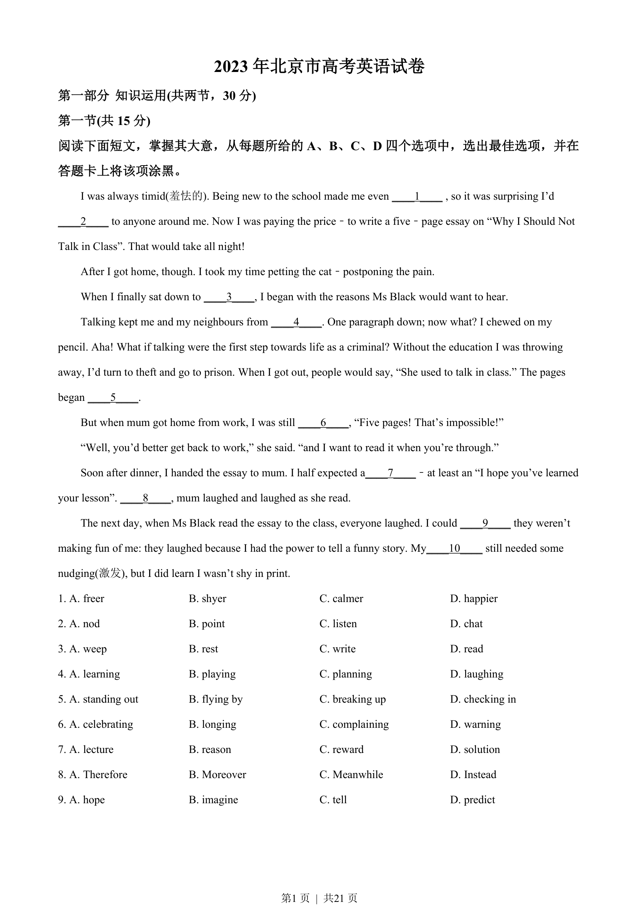
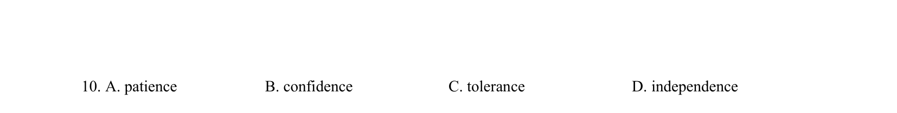
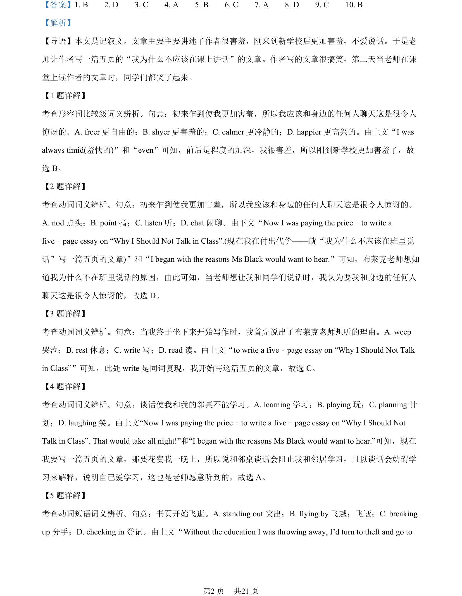
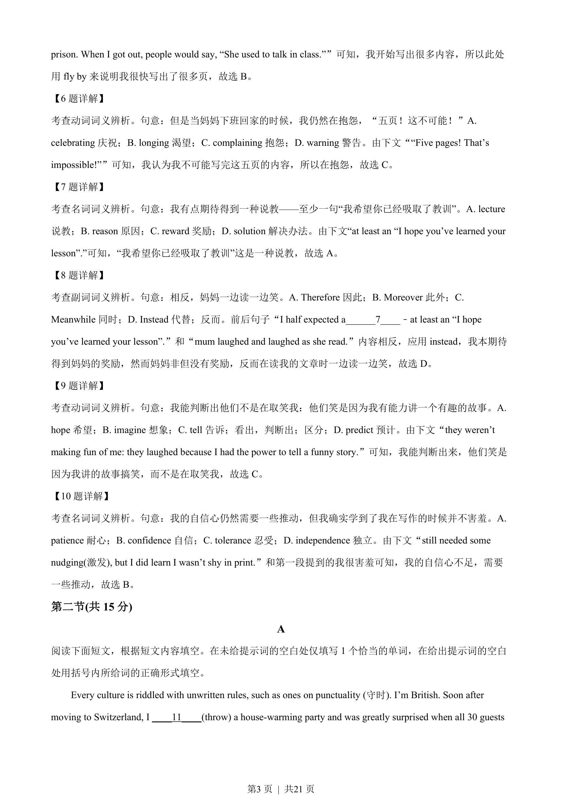
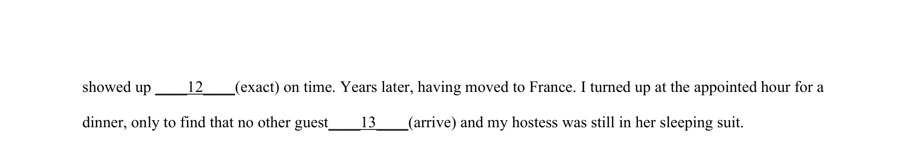

## 篇章题面

## 摘要

本文是记叙文。文章主要主要讲述了作者很害羞，刚来到新学校后更加害羞，不爱说话。于是老 师让作者写一篇五页的“我为什么不应该在课上讲话”的文章。作者写的文章很搞笑，第二天当老师在课 堂上读作者的文章时，同学们都笑了起来。

## 关联考点

- [[810-完形填空|完形填空]]
- [[900-词义辨析|词义辨析]]
- [[908-语境理解|语境理解]]

## 答案

`1. B 2. D 3. C 4. A 5. B 6. C 7. A 8. D 9. C 10. B`

## 解析

> 📄 原 PDF 第 2 页：`素材/真题/北京/2008-2024·（北京）英语高考真题/2023年高考英语试卷（北京）（机考 无听力）（解析卷）.pdf`
