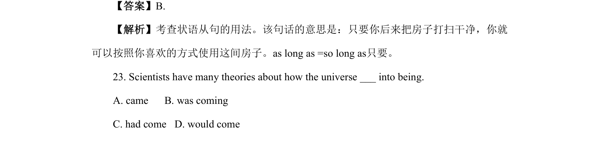
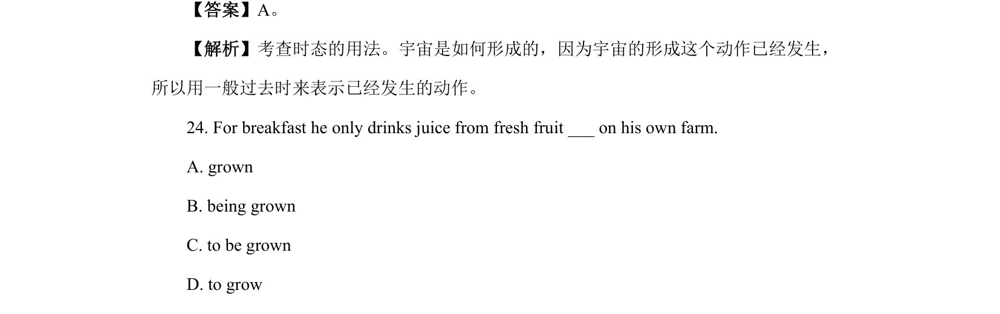

## 篇章题面

## 摘要

本文是说明文。红树林，生长在陆地和海洋之间，有助于软化海浪，保护城市免受沿海风的侵 袭，到目前为止，中国已建立了一批红树林保护区。

## 关联考点

- [[1031-语篇填空|语篇填空]]
- [[1018-语法填空|语法填空]]

## 答案

`14. seen 15. cities 16. has established`

## 解析

> 📄 原 PDF 第 4 页：`素材/真题/北京/2008-2024·（北京）英语高考真题/2023年高考英语试卷（北京）（机考 无听力）（解析卷）.pdf`
