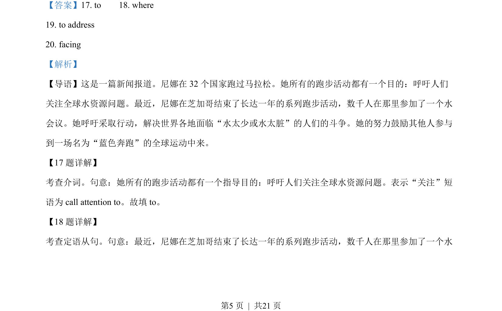
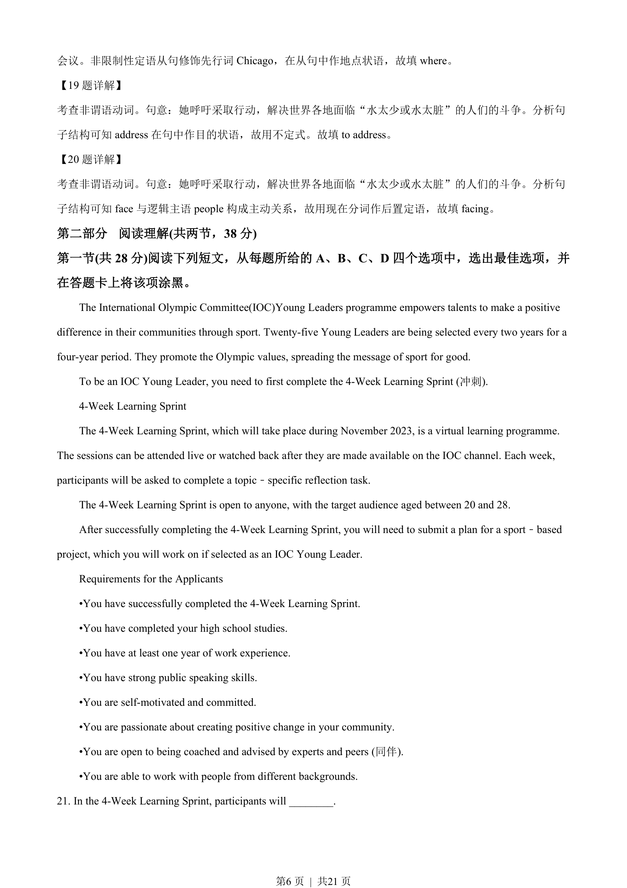
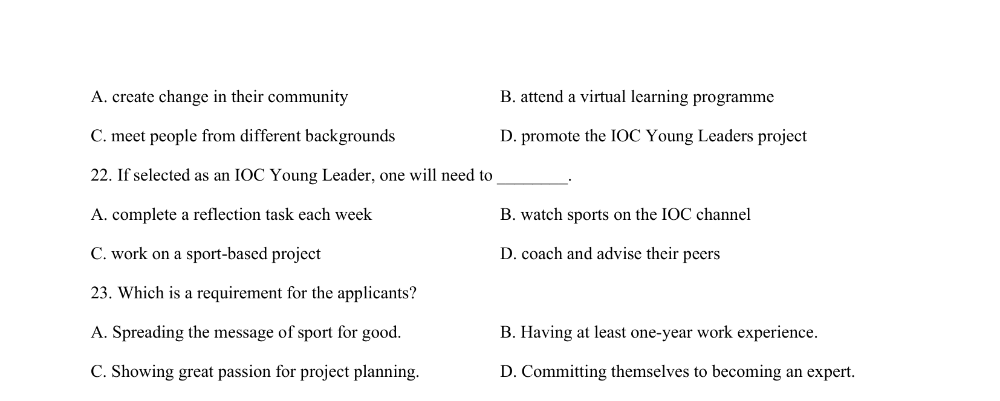
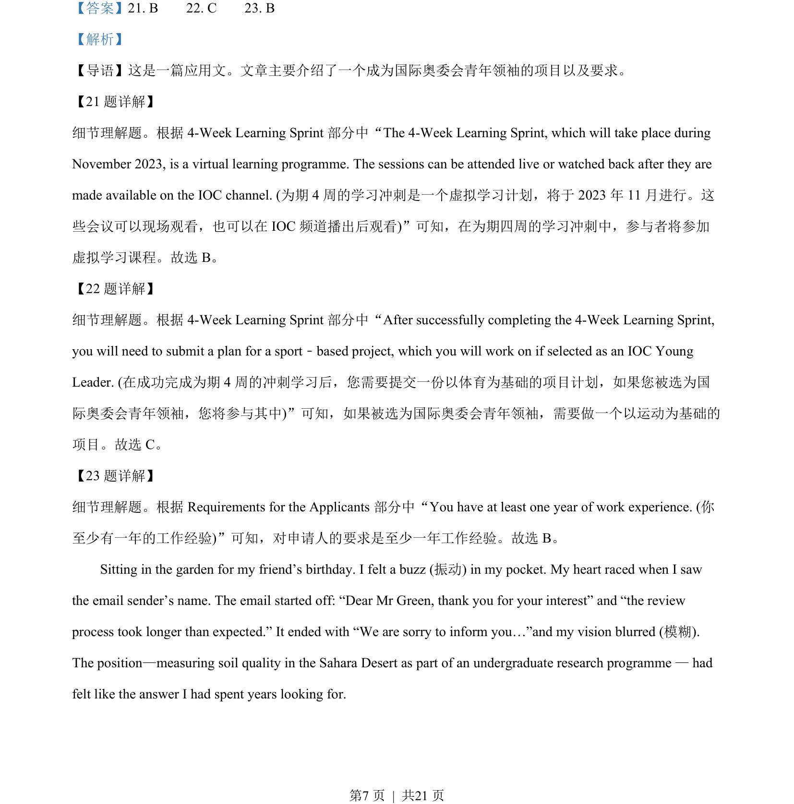
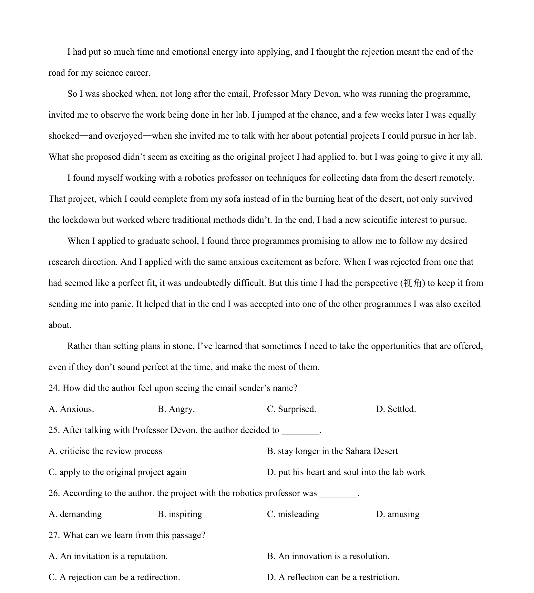

## 篇章题面

## 摘要

这是一篇应用文。文章主要介绍了一个成为国际奥委会青年领袖的项目以及要求。

## 关联考点

- [[724-reading comprehension|阅读理解]]
- [[689-Specific Information|细节理解]]
- [[887-推理判断|推理判断]]

## 答案

`21. B 22. C 23. B`

## 解析

> 📄 原 PDF 第 7 页：`素材/真题/北京/2008-2024·（北京）英语高考真题/2023年高考英语试卷（北京）（机考 无听力）（解析卷）.pdf`
