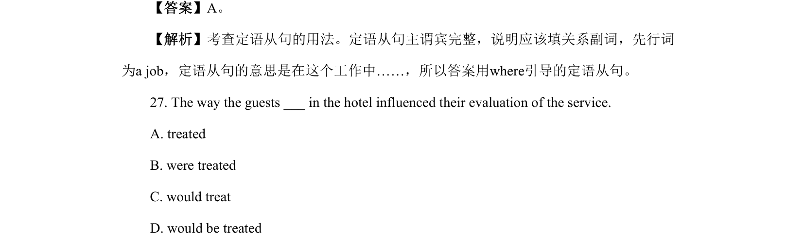
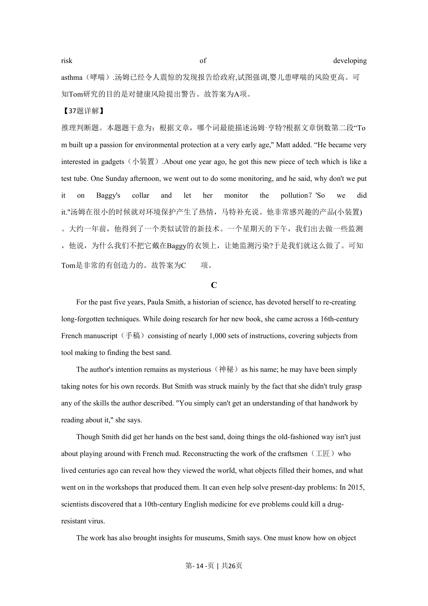

## 篇章题面

## 摘要

本文是一篇记叙文。文章中作者结合自己被拒绝后得到了更好的职业发展机会，告诉我们最初的 拒绝给予了更好的方向。

## 关联考点

- [[724-reading comprehension|阅读理解]]
- [[689-Specific Information|细节理解]]
- [[887-推理判断|推理判断]]
- [[146-记叙文要素|记叙文]]

## 答案

`24. A 25. D 26. B 27. C`

## 解析

> 📄 原 PDF 第 8 页：`素材/真题/北京/2008-2024·（北京）英语高考真题/2023年高考英语试卷（北京）（机考 无听力）（解析卷）.pdf`
