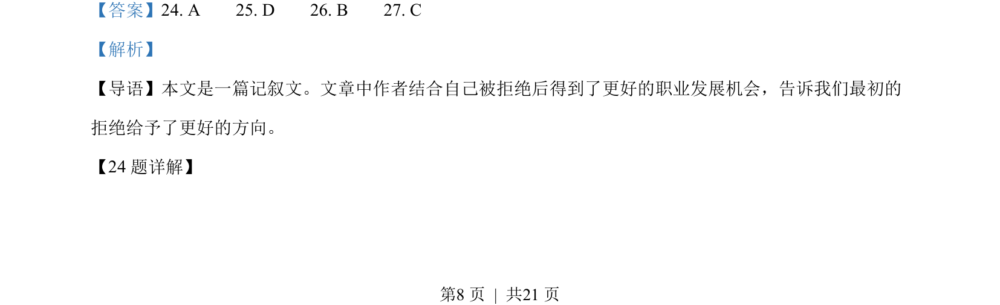
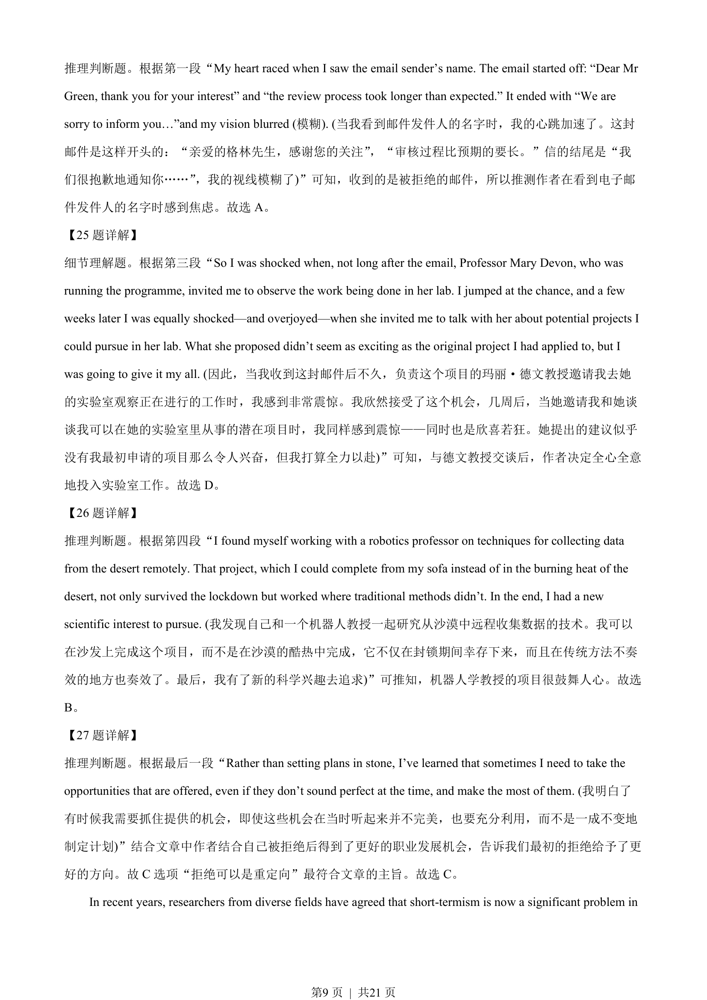
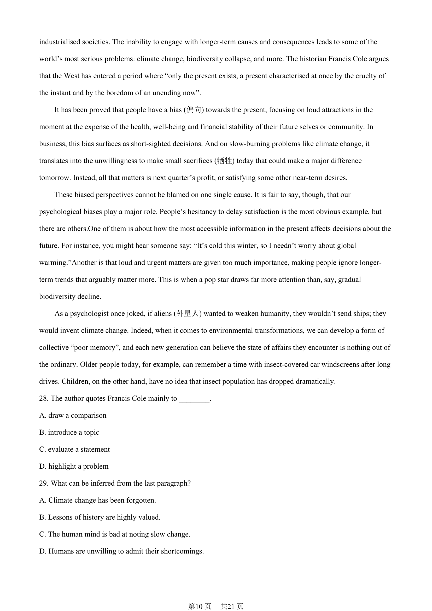
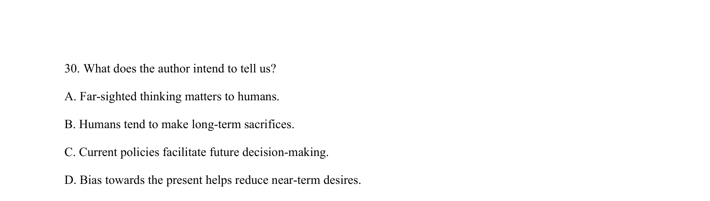
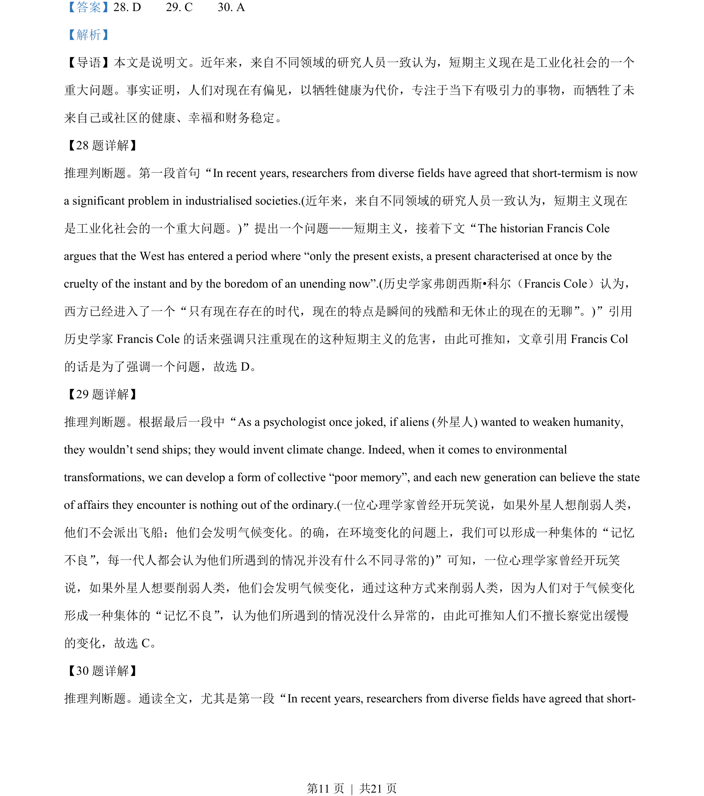
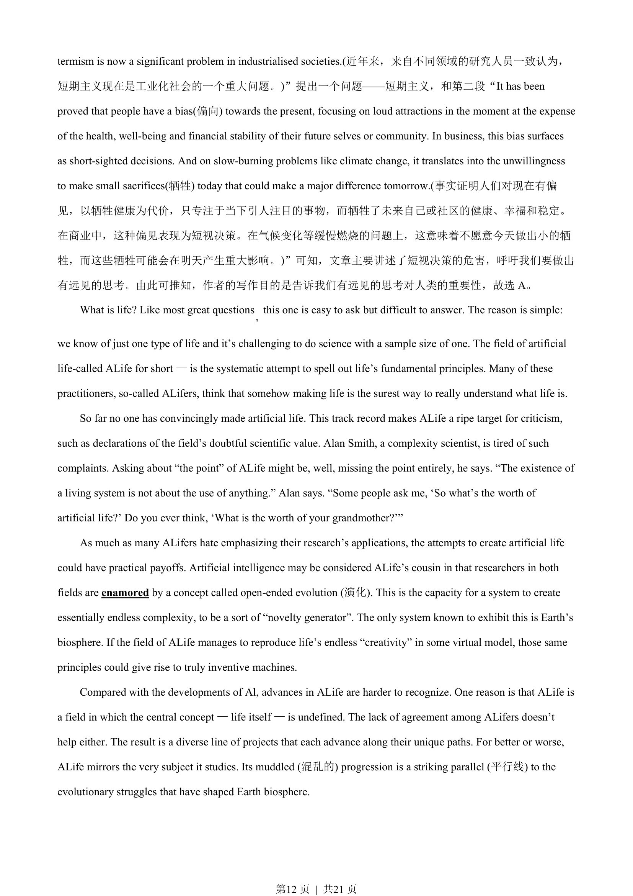
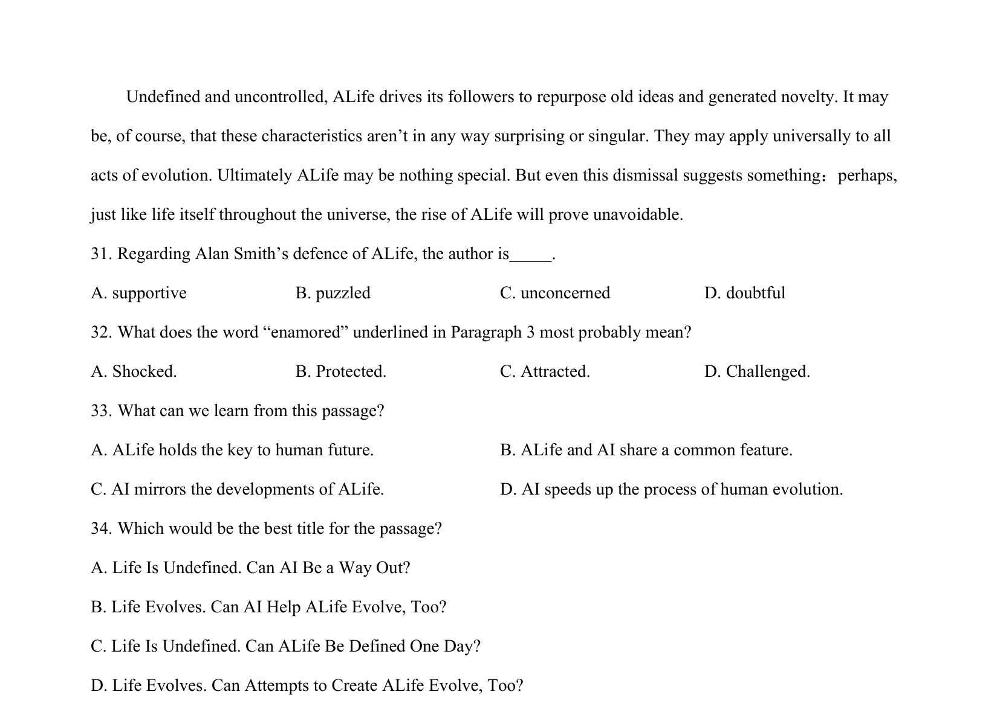

## 篇章题面

## 摘要

本文是说明文。近年来，来自不同领域的研究人员一致认为，短期主义现在是工业化社会的一个 重大问题。事实证明，人们对现在有偏见，以牺牲健康为代价，专注于当下有吸引力的事物，而牺牲了未 来自己或社区的健康、幸福和财务稳定。

## 关联考点

- [[724-reading comprehension|阅读理解]]
- [[689-Specific Information|细节理解]]
- [[887-推理判断|推理判断]]

## 答案

`28. D 29. C 30. A`

## 解析

> 📄 原 PDF 第 11 页：`素材/真题/北京/2008-2024·（北京）英语高考真题/2023年高考英语试卷（北京）（机考 无听力）（解析卷）.pdf`
