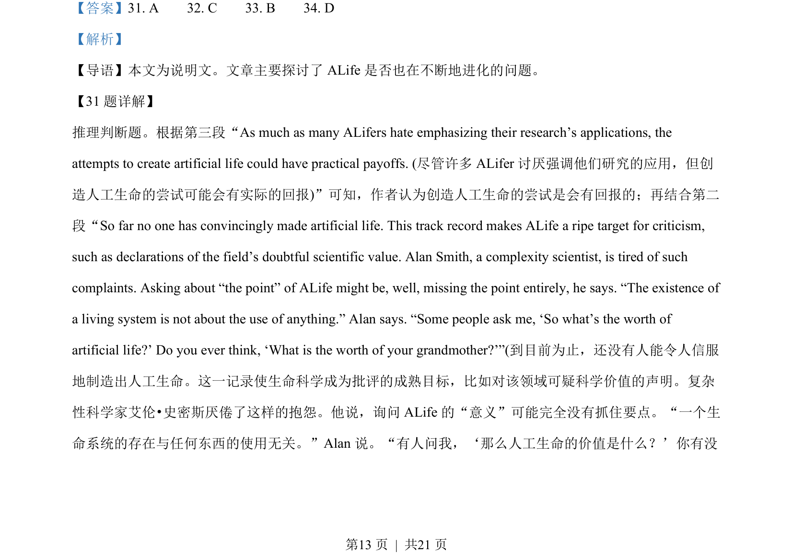
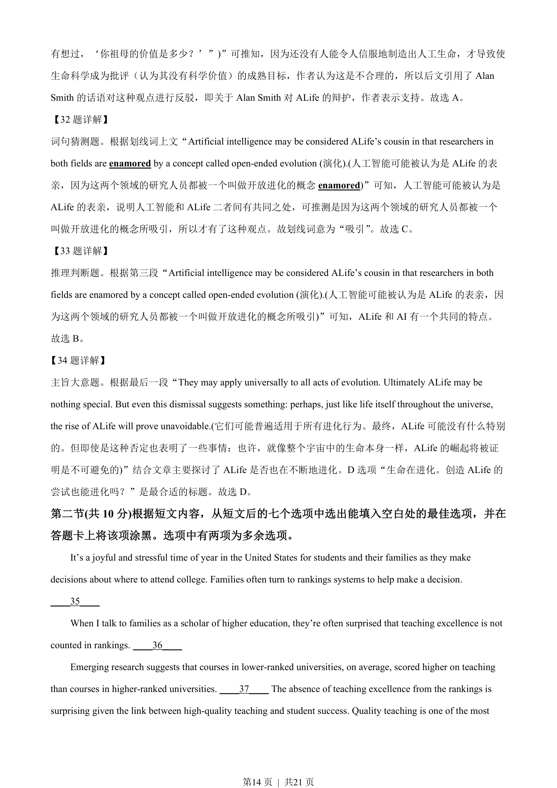
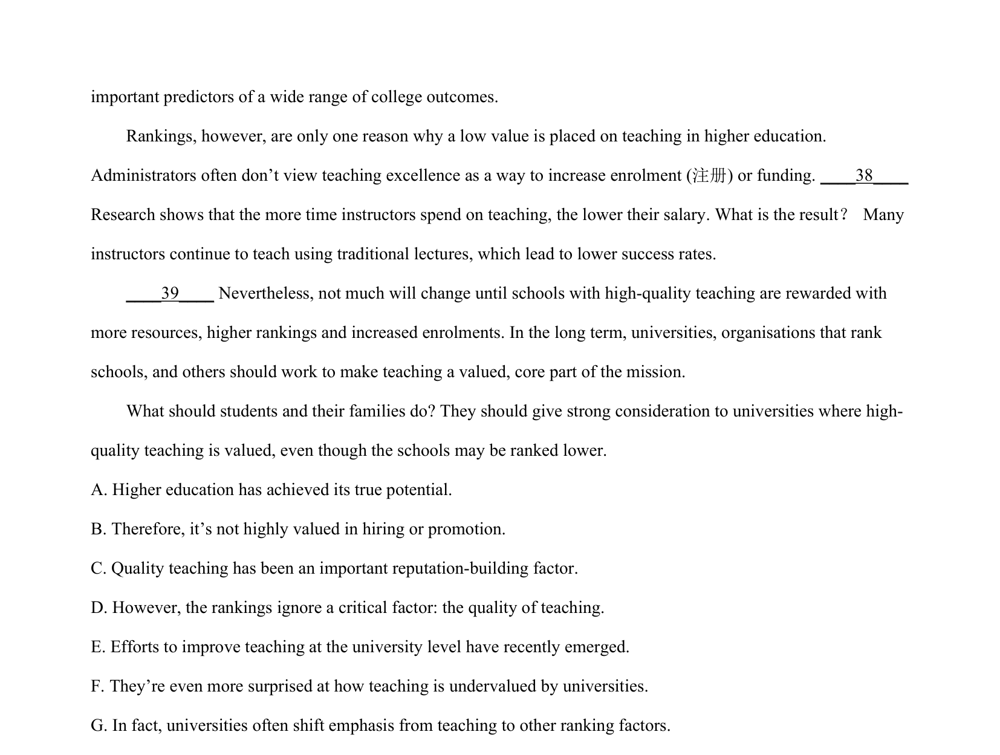
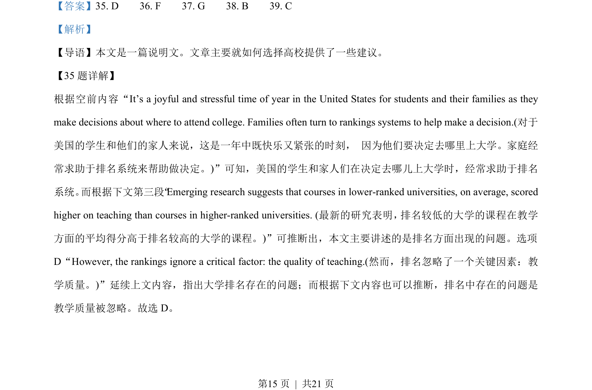
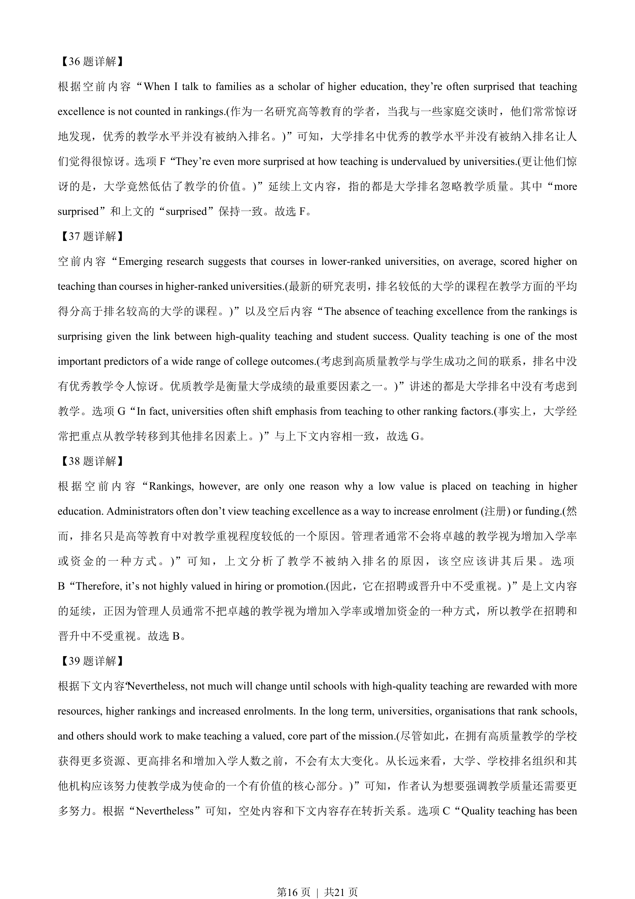
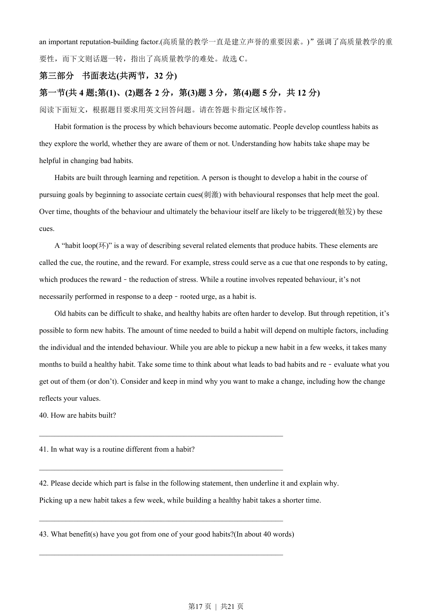

## 篇章题面

## 摘要

本文是一篇说明文。文章主要就如何选择高校提供了一些建议。

## 关联考点

- [[994-七选五|七选五]]
- [[1014-篇章结构|篇章结构]]
- [[550-说明文|说明文]]

## 答案

`35. D 36. F 37. G 38. B 39. C`

## 解析

> 📄 原 PDF 第 15 页：`素材/真题/北京/2008-2024·（北京）英语高考真题/2023年高考英语试卷（北京）（机考 无听力）（解析卷）.pdf`
