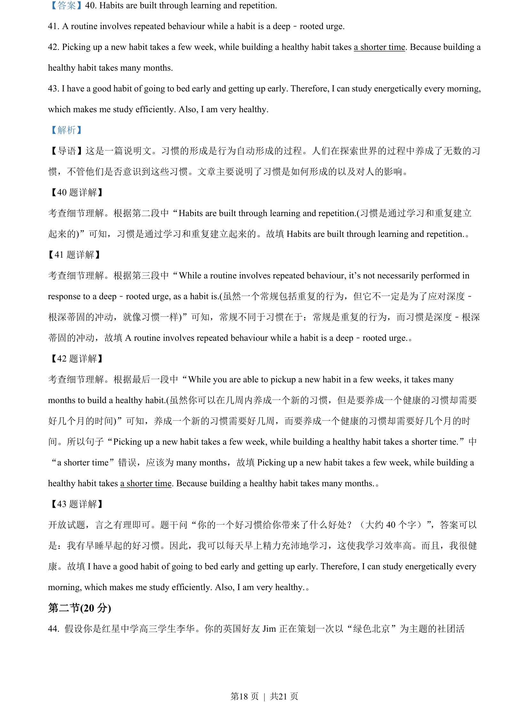
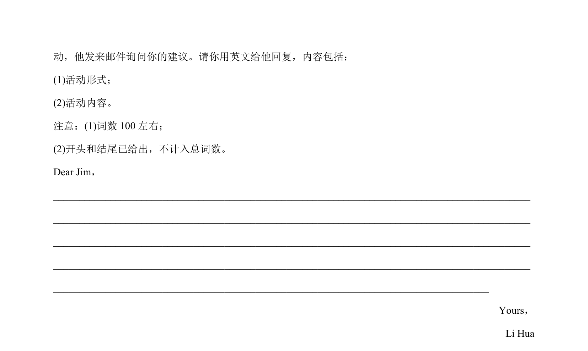

## 篇章题面

## 摘要

这是一篇说明文。习惯的形成是行为自动形成的过程。人们在探索世界的过程中养成了无数的习 惯，不管他们是否意识到这些习惯。文章主要说明了习惯是如何形成的以及对人的影响。

## 关联考点

- [[1032-阅读表达|阅读表达]]
- [[1030-信息归纳|信息归纳]]

## 答案

`40. Habits are built through learning and repetition. 41. A routine involves repeated behaviour while a habit is a deep﹣rooted urge. 42. Picking up a new habit takes a few week, while building a healthy habit takes a shorter time. Because building a healthy habit takes many months. 43. I have a good`

## 解析

> 📄 原 PDF 第 18 页：`素材/真题/北京/2008-2024·（北京）英语高考真题/2023年高考英语试卷（北京）（机考 无听力）（解析卷）.pdf`
