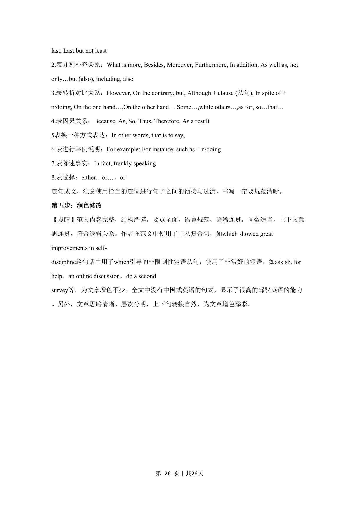

## 篇章题面

## 摘要

本篇书面表达属于应用文。要求考生给好友Jim 策划的“绿色北京”社团活动给出一些建议。

## 关联考点

- [[996-书面表达|书面表达]]
- [[1007-应用文写作|应用文写作]]

## 答案

`Dear Jim Hearing that you are planning a club activity with the theme of “Green Beijing” and need my help, I am writing to offer you my suggestions. I think you can carry out this activity in an interactive and experiential manner, which means students can participate and have a better understanding`

## 解析

> 📄 原 PDF 第 19 页：`素材/真题/北京/2008-2024·（北京）英语高考真题/2023年高考英语试卷（北京）（机考 无听力）（解析卷）.pdf`
