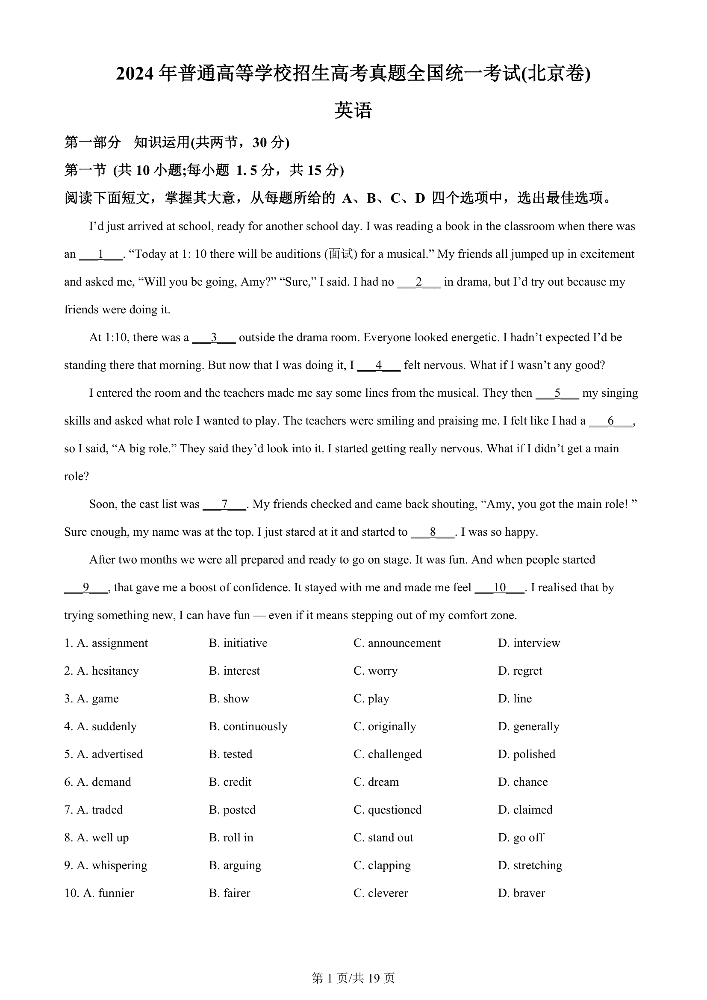
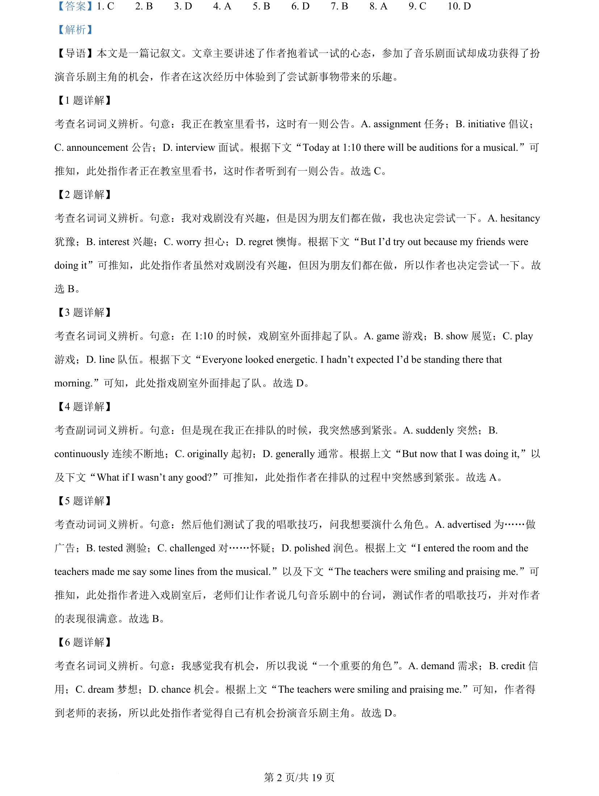
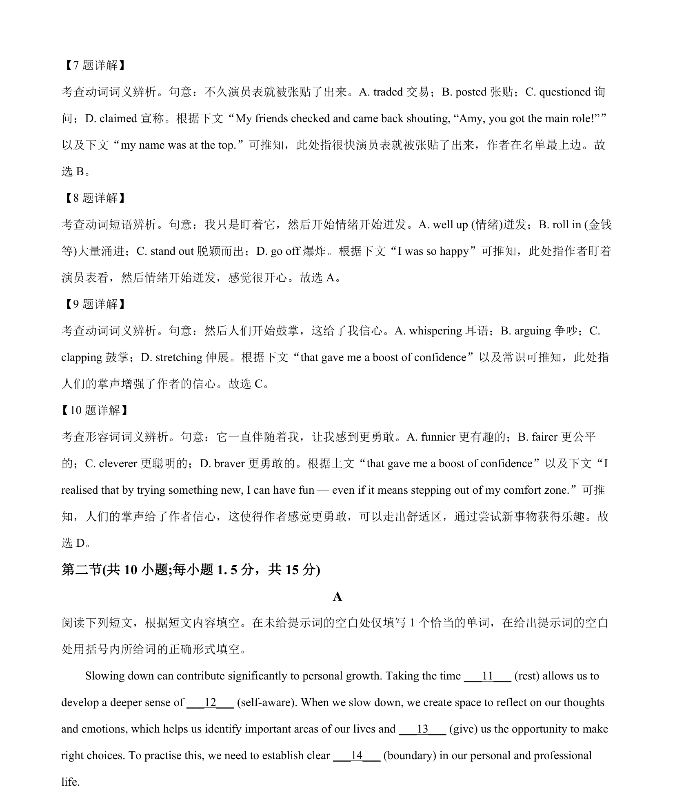

## 篇章题面

## 摘要

本文是一篇记叙文。文章主要讲述了作者抱着试一试的心态，参加了音乐剧面试却成功获得了扮 演音乐剧主角的机会，作者在这次经历中体验到了尝试新事物带来的乐趣。

## 关联考点

- [[810-完形填空|完形填空]]
- [[900-词义辨析|词义辨析]]
- [[908-语境理解|语境理解]]
- [[146-记叙文要素|记叙文]]

## 答案

`1. C 2. B 3. D 4. A 5. B 6. D 7. B 8. A 9. C 10. D`

## 解析

> 📄 原 PDF 第 2 页：`素材/真题/北京/2008-2024·（北京）英语高考真题/2024年高考英语试卷（北京）（机考 无听力）（解析卷）.pdf`
