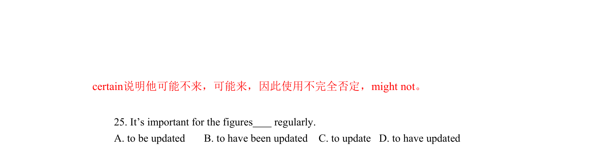
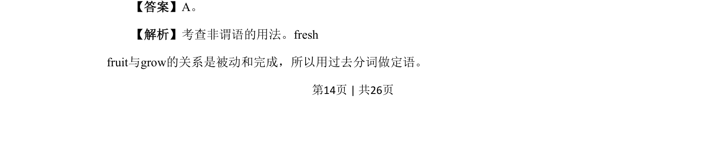

## 篇章题面

## 摘要

本文是一篇记叙文。主要讲述了作者为一个掉落东西的男孩提供帮助的故事。

## 关联考点

- [[1031-语篇填空|语篇填空]]
- [[1018-语法填空|语法填空]]
- [[146-记叙文要素|记叙文]]

## 答案

`18. to 19. knocking 20. jogged`

## 解析

> 📄 原 PDF 第 5 页：`素材/真题/北京/2008-2024·（北京）英语高考真题/2024年高考英语试卷（北京）（机考 无听力）（解析卷）.pdf`
