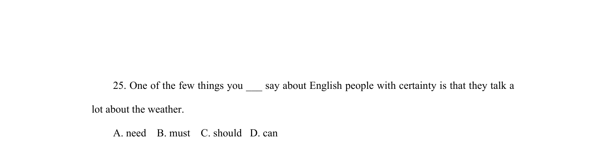
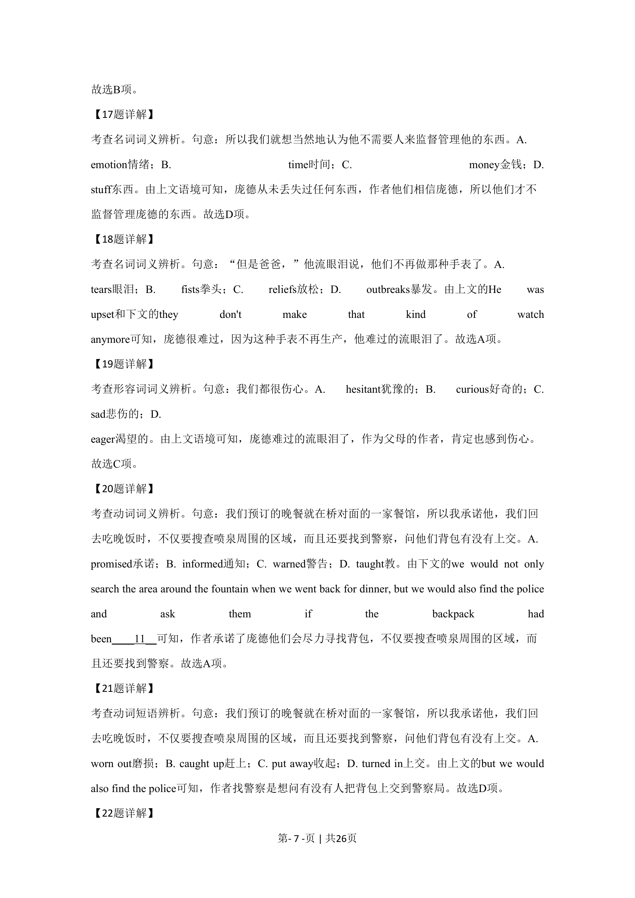
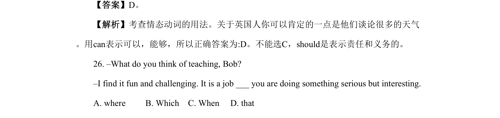
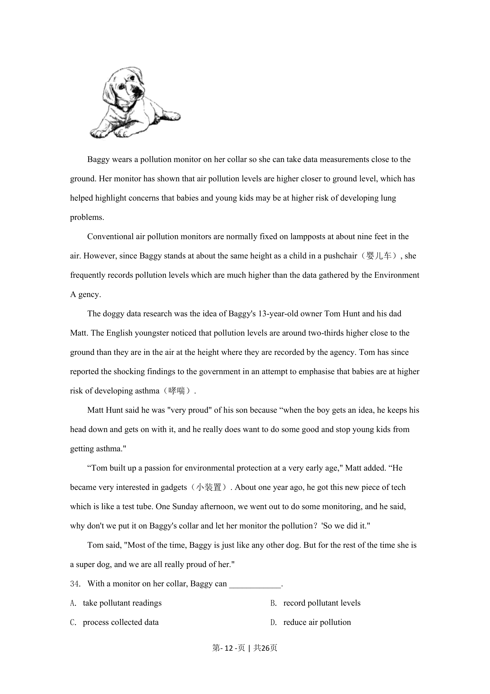

## 篇章题面

## 摘要

本文是一篇应用文。文章主要介绍了一项语言交流项目的基本情况以及它的要求、报名和注册流 程以及注意事项的相关信息。

## 关联考点

- [[725-reading comprehension|阅读理解]]
- [[690-Specific Information|细节理解]]
- [[888-推理判断|推理判断]]
- [[651-应用文|应用文]]

## 答案

`21. D 22. B 23. A`

## 解析

> 📄 原 PDF 第 7 页：`素材/真题/北京/2008-2024·（北京）英语高考真题/2024年高考英语试卷（北京）（机考 无听力）（解析卷）.pdf`
