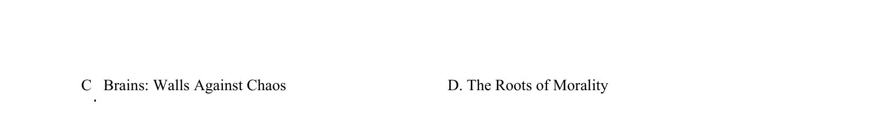

## 篇章题面

## 摘要

本文是一篇议论文。文章主要讨论了哲学家对于宇宙的认知和信息时代下的作者对于宇宙争论的 看法。

## 关联考点

- [[724-reading comprehension|阅读理解]]
- [[689-Specific Information|细节理解]]
- [[887-推理判断|推理判断]]
- [[175-议论文入门|议论文]]

## 答案

`28. C 29. B 30. A 31. C`

## 解析

> 📄 原 PDF 第 10 页：`素材/真题/北京/2008-2024·（北京）英语高考真题/2024年高考英语试卷（北京）（机考 无听力）（解析卷）.pdf`
