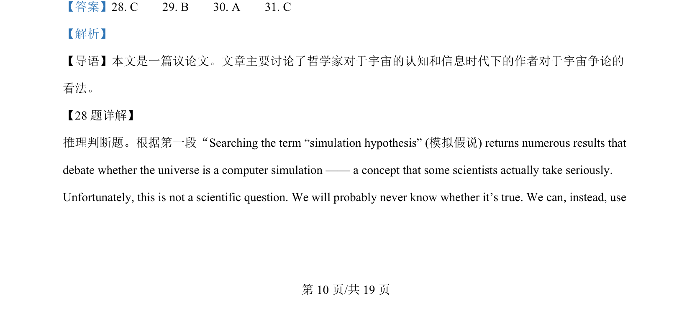
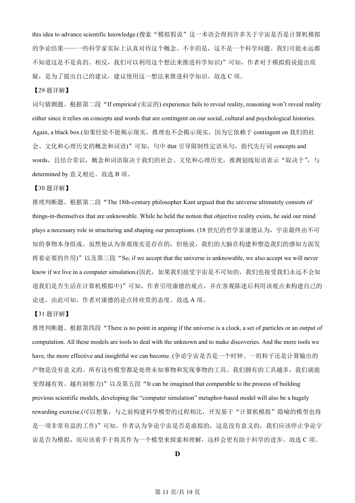
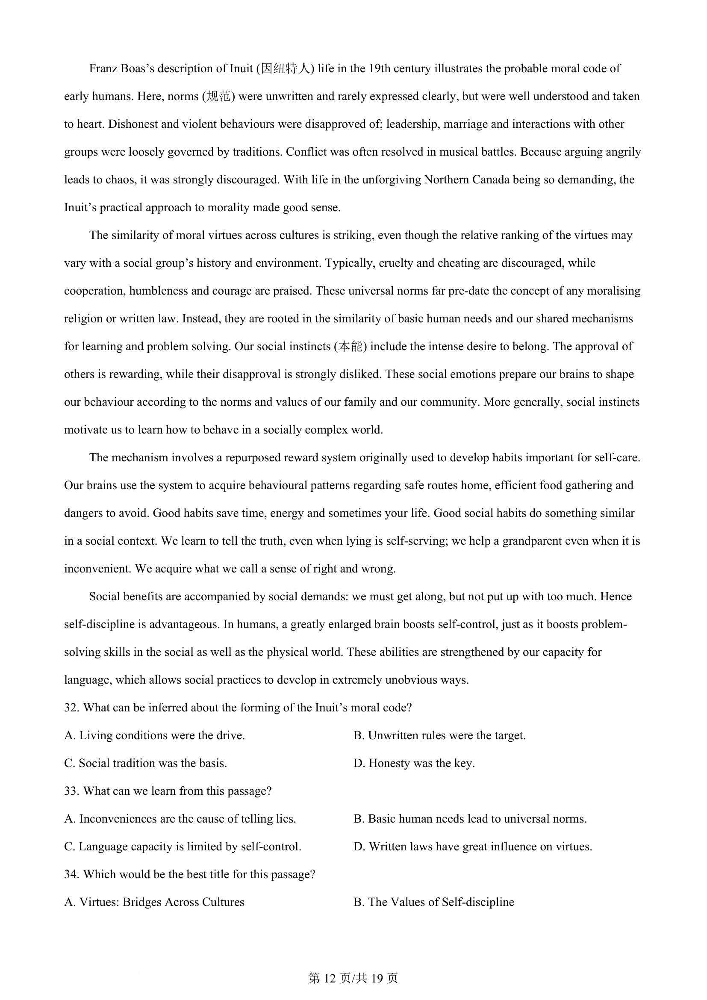
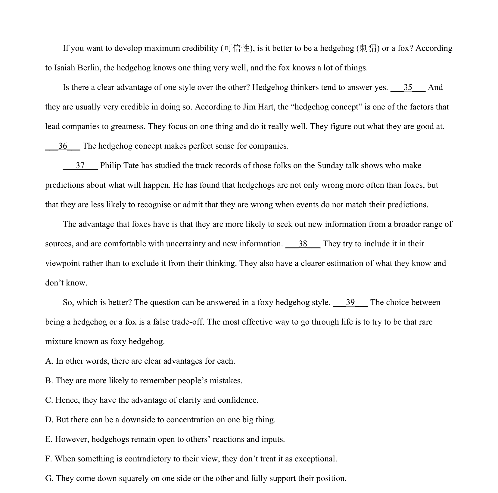

## 篇章题面

## 摘要

本文是一篇说明文。主要围绕人类道德规范的起源进行讨论，介绍了早期人类道德准则的形成过 程及其如何根植于人类基本需求及共同的社会学习和问题解决机制中。

## 关联考点

- [[724-reading comprehension|阅读理解]]
- [[689-Specific Information|细节理解]]
- [[887-推理判断|推理判断]]
- [[550-说明文|说明文]]

## 答案

`32. C 33. B 34. D`

## 解析

> 📄 原 PDF 第 13 页：`素材/真题/北京/2008-2024·（北京）英语高考真题/2024年高考英语试卷（北京）（机考 无听力）（解析卷）.pdf`
