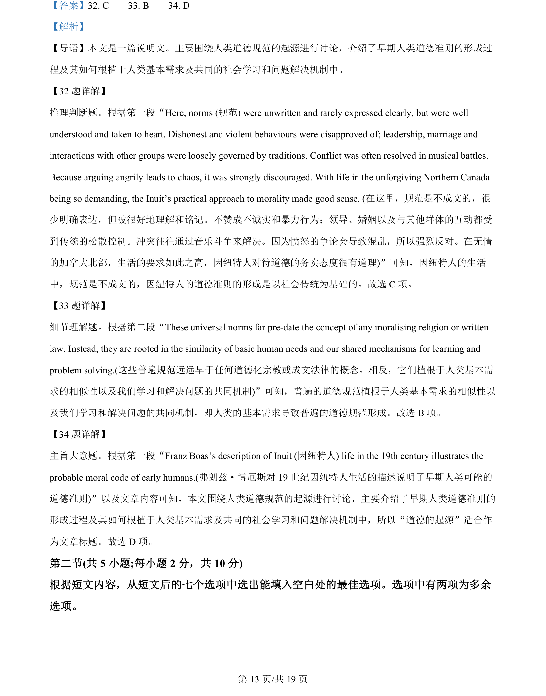

## 篇章题面

## 摘要

本文是一篇说明文。主要介绍了拥有“刺猬”型思维方式和“狐狸”型思维方式的两类人对于个 人和企业建立信誉度的优劣势。

## 关联考点

- [[994-七选五|七选五]]
- [[1014-篇章结构|篇章结构]]
- [[550-说明文|说明文]]

## 答案

`35. G 36. C 37. D 38. F 39. A`

## 解析

> 📄 原 PDF 第 14 页：`素材/真题/北京/2008-2024·（北京）英语高考真题/2024年高考英语试卷（北京）（机考 无听力）（解析卷）.pdf`
