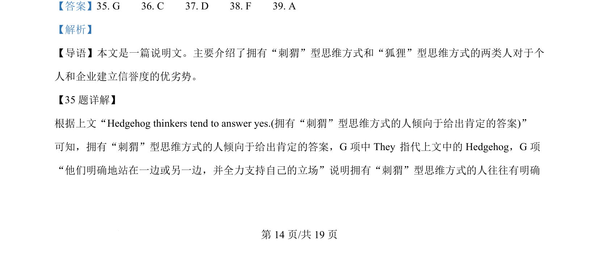
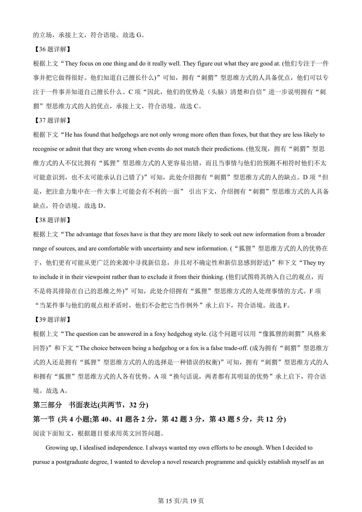
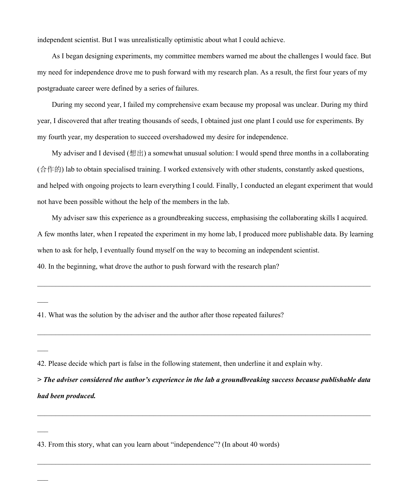
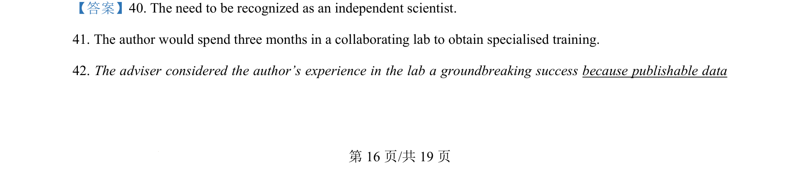
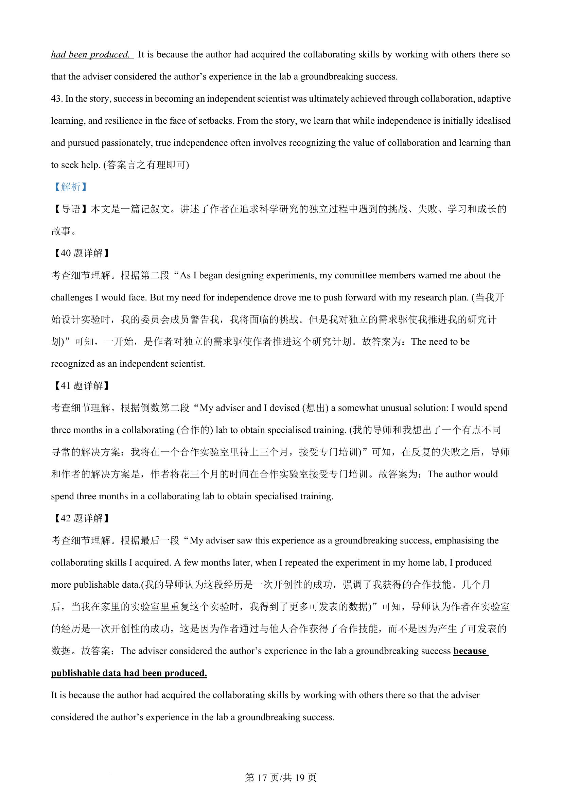
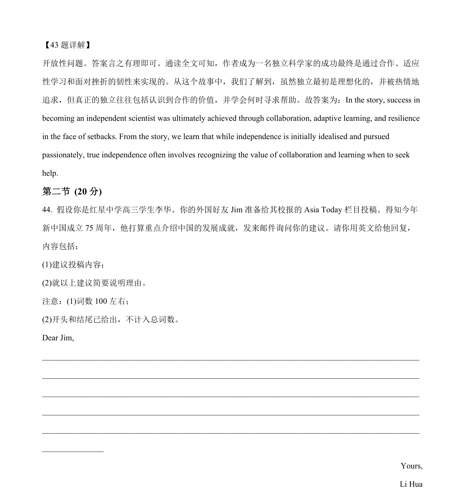

## 篇章题面

## 摘要

本文是一篇记叙文。讲述了作者在追求科学研究的独立过程中遇到的挑战、失败、学习和成长的 故事。

## 关联考点

- [[1032-阅读表达|阅读表达]]
- [[1030-信息归纳|信息归纳]]
- [[146-记叙文要素|记叙文]]

## 答案

`40. The need to be recognized as an independent scientist. 41. The author would spend three months in a collaborating lab to obtain specialised training. 42. The adviser considered the author’s experience in the lab a groundbreaking success because publishable data had been produced. It is because t`

## 解析

> 📄 原 PDF 第 16 页：`素材/真题/北京/2008-2024·（北京）英语高考真题/2024年高考英语试卷（北京）（机考 无听力）（解析卷）.pdf`
