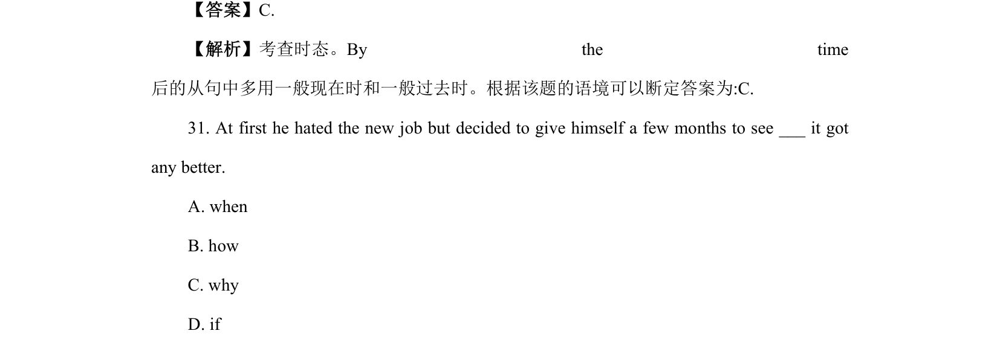
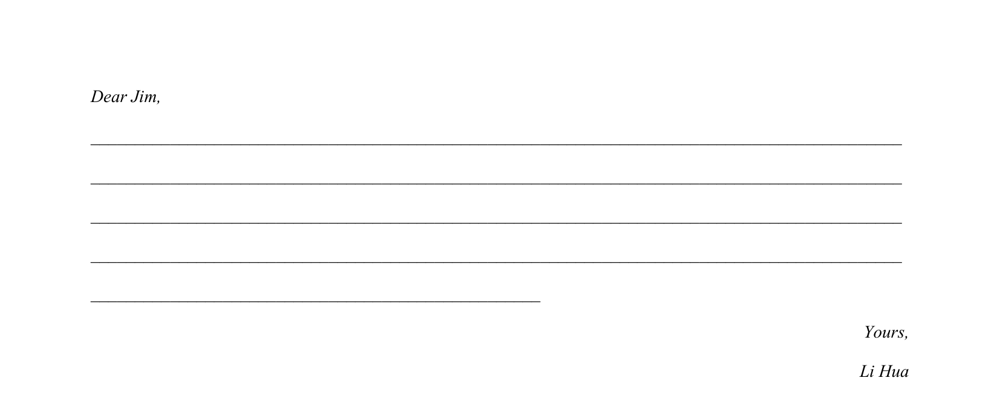
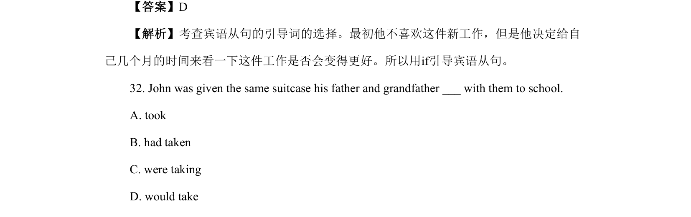
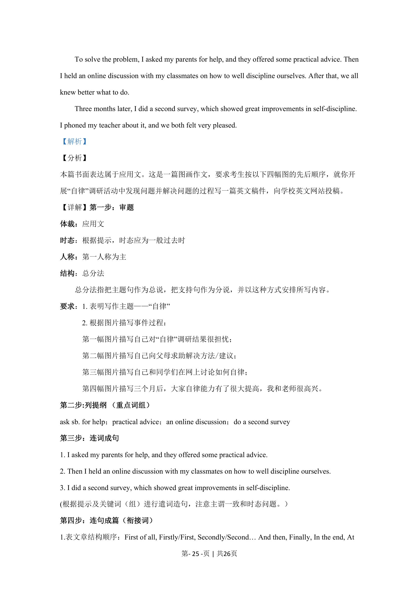

## 篇章题面

## 摘要

本篇书面表达属于应用文写。外国好友Jim 准备给其校报的Asia Today 栏目投稿。得知今年新中 国成立75 周年，他打算重点介绍中国的发展成就，要求考生给他回复邮件，就此给予他建议。

## 关联考点

- [[998-书面表达|书面表达]]
- [[1009-应用文写作|应用文写作]]

## 答案

`Dear Jim, It’s great to hear you’re planning to write about China’s achievements on the occasion of the 75th anniversary of the founding of this country. Here are a few suggestions for your article. To begin with, talk about China’s economic growth and technological advancements, which are the highl`

## 解析

> 📄 原 PDF 第 18 页：`素材/真题/北京/2008-2024·（北京）英语高考真题/2024年高考英语试卷（北京）（机考 无听力）（解析卷）.pdf`
