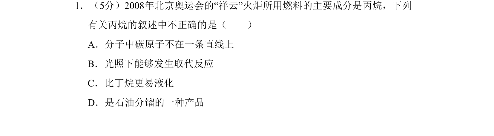
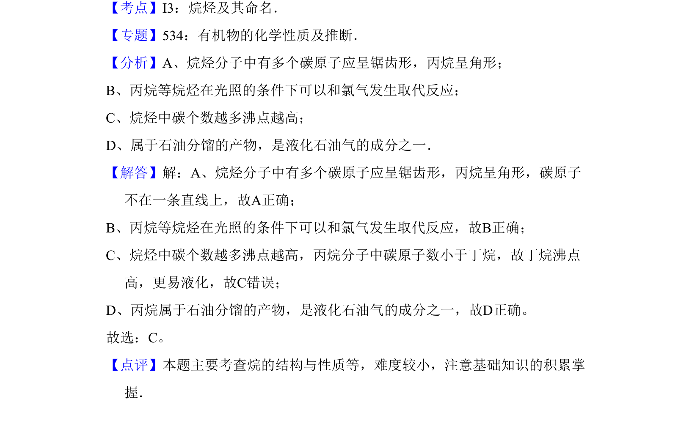

## 题面

## 摘要

本题主要考查烷烃（丙烷）的结构、性质及相关应用判断。

## 关联考点

- [[771-烷烃结构|烷烃结构]]
- [[651-取代反应|取代反应]]
- [[747-沸点比较|沸点比较]]
- [[277-石油分馏|石油分馏]]

## 答案与解析

> 📄 原 PDF 第 1 页：`素材/真题/吉林/2008-2024·（吉林）化学高考真题/2008年高考化学试卷（全国卷Ⅱ）（解析卷）.pdf`
