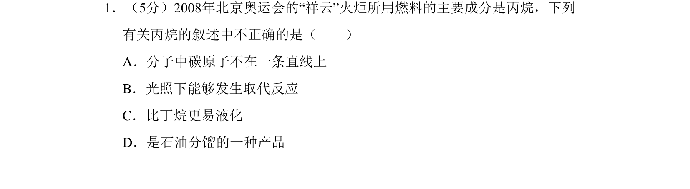
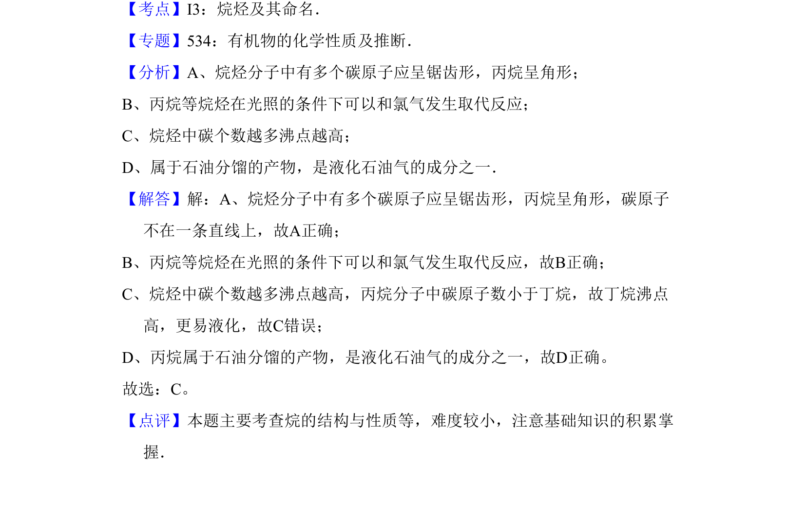

## 题面

## 摘要

本题主要考查烷烃（丙烷）的结构、性质及相关应用判断。

## 关联考点

- [[771-烷烃结构|烷烃结构]]
- [[651-取代反应|取代反应]]
- [[747-沸点比较|沸点比较]]
- [[277-石油分馏|石油分馏]]

## 答案与解析

> 📄 原 PDF 第 1 页：`素材/真题/吉林/2008-2024·（吉林）化学高考真题/2008年高考化学试卷（全国卷Ⅱ）（解析卷）.pdf`

<!-- 题干文本-start -->
## 题干文本
1．（5分）2008年北京奥运会的“祥云”火炬所用燃料的主要成分是丙烷，下列
有关丙烷的叙述中不正确的是（　　）
A．分子中碳原子不在一条直线上
B．光照下能够发生取代反应
C．比丁烷更易液化
D．是石油分馏的一种产品
<!-- 题干文本-end -->

<!-- 解析文本-start -->
## 解析文本
【考点】I3：烷烃及其命名．菁优网版权所有
【专题】534：有机物的化学性质及推断．
【分析】A、烷烃分子中有多个碳原子应呈锯齿形，丙烷呈角形；
B、丙烷等烷烃在光照的条件下可以和氯气发生取代反应；
C、烷烃中碳个数越多沸点越高；
D、属于石油分馏的产物，是液化石油气的成分之一．
【解答】解：A、烷烃分子中有多个碳原子应呈锯齿形，丙烷呈角形，碳原子
不在一条直线上，故A正确；
B、丙烷等烷烃在光照的条件下可以和氯气发生取代反应，故B正确；
C、烷烃中碳个数越多沸点越高，丙烷分子中碳原子数小于丁烷，故丁烷沸点
高，更易液化，故C错误；
D、丙烷属于石油分馏的产物，是液化石油气的成分之一，故D正确。
故选：C。
【点评】本题主要考查烷的结构与性质等，难度较小，注意基础知识的积累掌
握．
<!-- 解析文本-end -->
