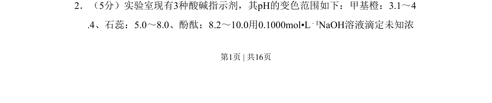
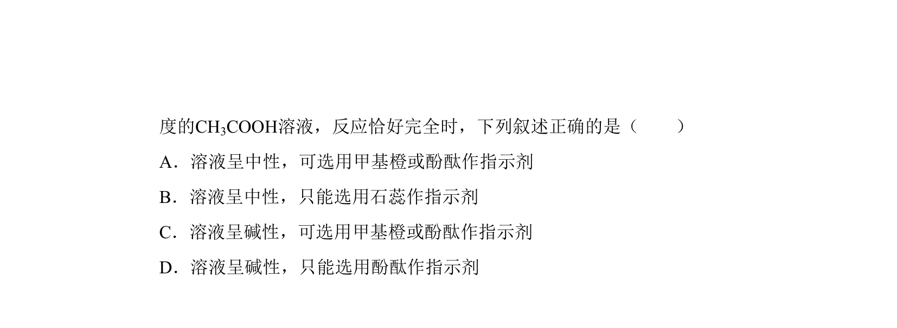
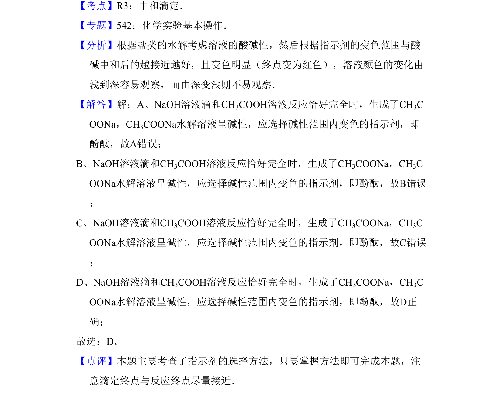

## 题面

## 摘要

考查酸碱中和滴定中指示剂的选择与变色范围判断。

## 关联考点

- [[854-酸碱滴定|酸碱滴定]]
- [[889-指示剂变色范围|指示剂变色范围]]
- [[136-pH值|pH]]

## 答案与解析

> 📄 原 PDF 第 1 页：`素材/真题/吉林/2008-2024·（吉林）化学高考真题/2008年高考化学试卷（全国卷Ⅱ）（解析卷）.pdf`

<!-- 题干文本-start -->
## 题干文本
2．（5分）实验室现有3种酸碱指示剂，其pH的变色范围如下：甲基橙：3.1～4
.4、石蕊：5.0～8.0、酚酞：8.2～10.0用0.1000mol•L﹣1NaOH溶液滴定未知浓
<!-- 题干文本-end -->

<!-- 解析文本-start -->
## 解析文本

<!-- 解析文本-end -->
