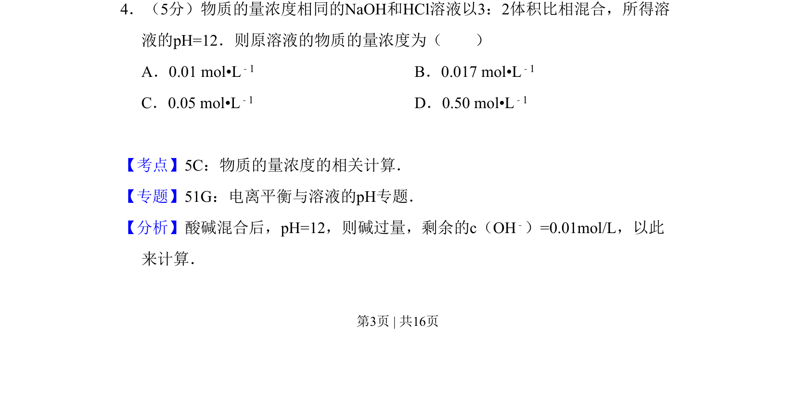
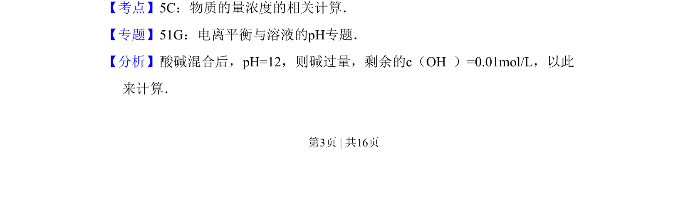
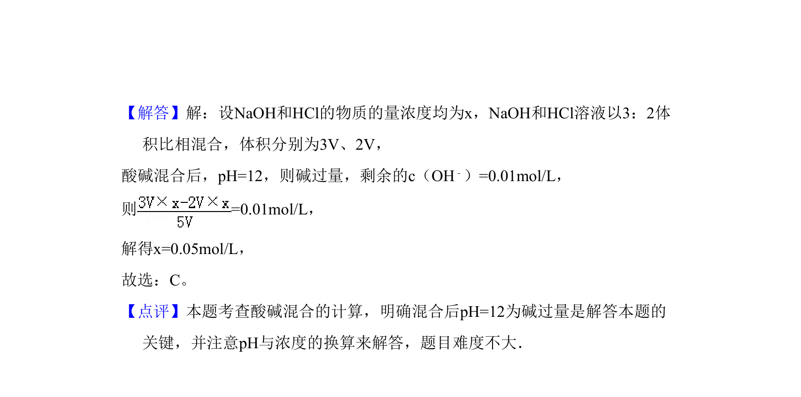

## 题面

## 摘要

酸碱混合pH计算，利用过量碱的浓度反推原溶液物质的量浓度

## 关联考点

- [[782-物质的量浓度|物质的量浓度]]
- [[136-pH值|pH]]
- [[137-中和反应|酸碱中和]]
- [[334-电离平衡|电离平衡]]

## 答案与解析

> 📄 原 PDF 第 3 页：`素材/真题/吉林/2008-2024·（吉林）化学高考真题/2008年高考化学试卷（全国卷Ⅱ）（解析卷）.pdf`
