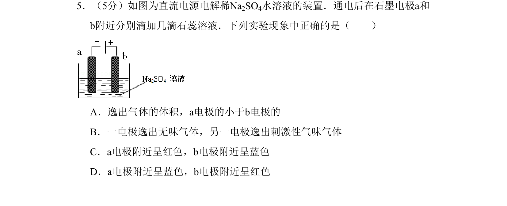
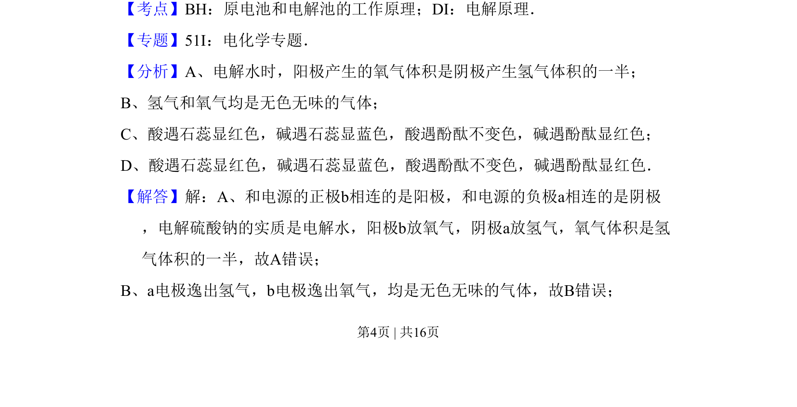

## 题面

## 摘要

这是一道关于电解池原理和酸碱指示剂显色的电化学题，通过电解硫酸钠溶液判断电极反应及石蕊变色现象。

## 关联考点

- [[原电池和电解池的工作原理]]
- [[367-电解原理|电解原理]]

## 答案与解析

> 📄 原 PDF 第 4 页：`素材/真题/吉林/2008-2024·（吉林）化学高考真题/2008年高考化学试卷（全国卷Ⅱ）（解析卷）.pdf`
