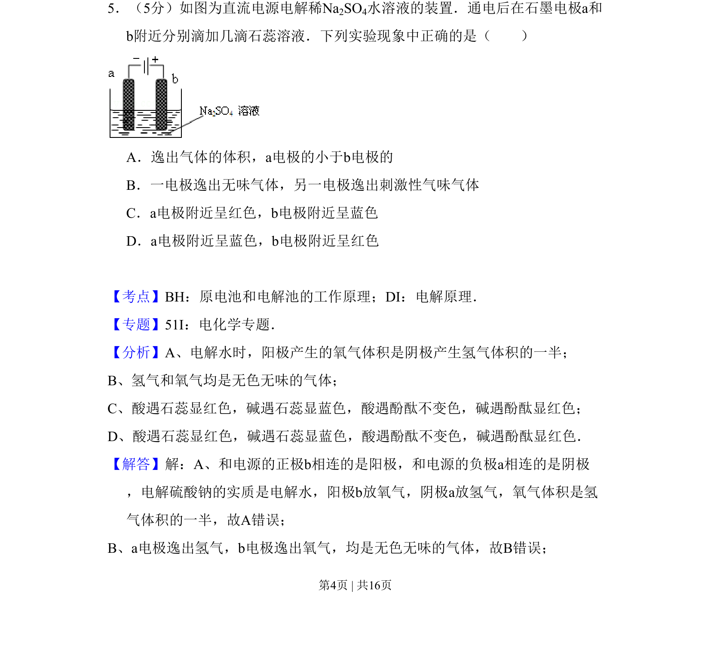
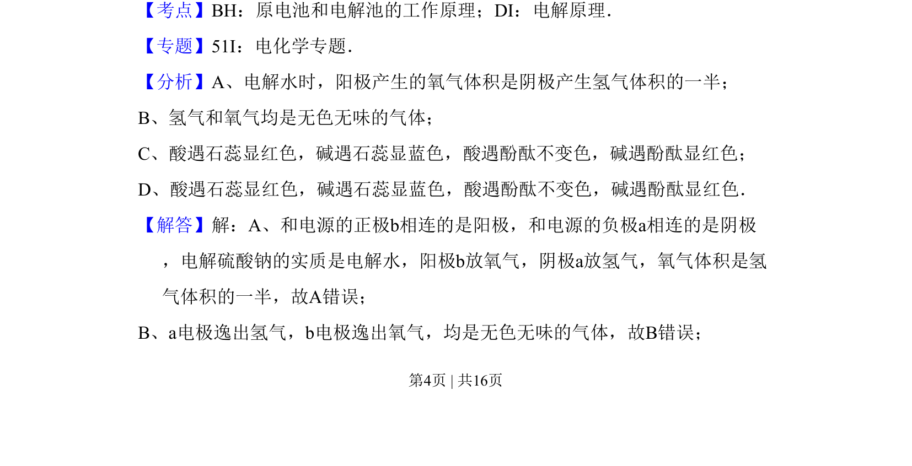
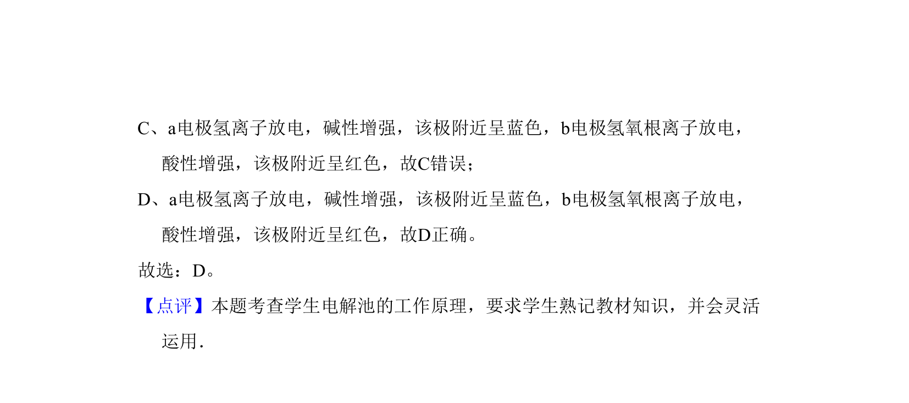

## 题面

## 摘要

这是一道关于电解池原理和酸碱指示剂显色的电化学题，通过电解硫酸钠溶液判断电极反应及石蕊变色现象。

## 关联考点

- [[532-原电池和电解池的工作原理|原电池和电解池的工作原理]]
- [[367-电解原理|电解原理]]

## 答案与解析

> 📄 原 PDF 第 4 页：`素材/真题/吉林/2008-2024·（吉林）化学高考真题/2008年高考化学试卷（全国卷Ⅱ）（解析卷）.pdf`

<!-- 题干文本-start -->
## 题干文本
5．（5分）如图为直流电源电解稀Na2SO4水溶液的装置．通电后在石墨电极a和
b附近分别滴加几滴石蕊溶液．下列实验现象中正确的是（　　）
A．逸出气体的体积，a电极的小于b电极的
B．一电极逸出无味气体，另一电极逸出刺激性气味气体
C．a电极附近呈红色，b电极附近呈蓝色
D．a电极附近呈蓝色，b电极附近呈红色
<!-- 题干文本-end -->

<!-- 解析文本-start -->
## 解析文本
【考点】BH：原电池和电解池的工作原理；DI：电解原理．菁优网版权所有
【专题】51I：电化学专题．
【分析】A、电解水时，阳极产生的氧气体积是阴极产生氢气体积的一半；
B、氢气和氧气均是无色无味的气体；
C、酸遇石蕊显红色，碱遇石蕊显蓝色，酸遇酚酞不变色，碱遇酚酞显红色；
D、酸遇石蕊显红色，碱遇石蕊显蓝色，酸遇酚酞不变色，碱遇酚酞显红色．
【解答】解：A、和电源的正极b相连的是阳极，和电源的负极a相连的是阴极
，电解硫酸钠的实质是电解水，阳极b放氧气，阴极a放氢气，氧气体积是氢
气体积的一半，故A错误；
B、a电极逸出氢气，b电极逸出氧气，均是无色无味的气体，故B错误；
<!-- 解析文本-end -->
