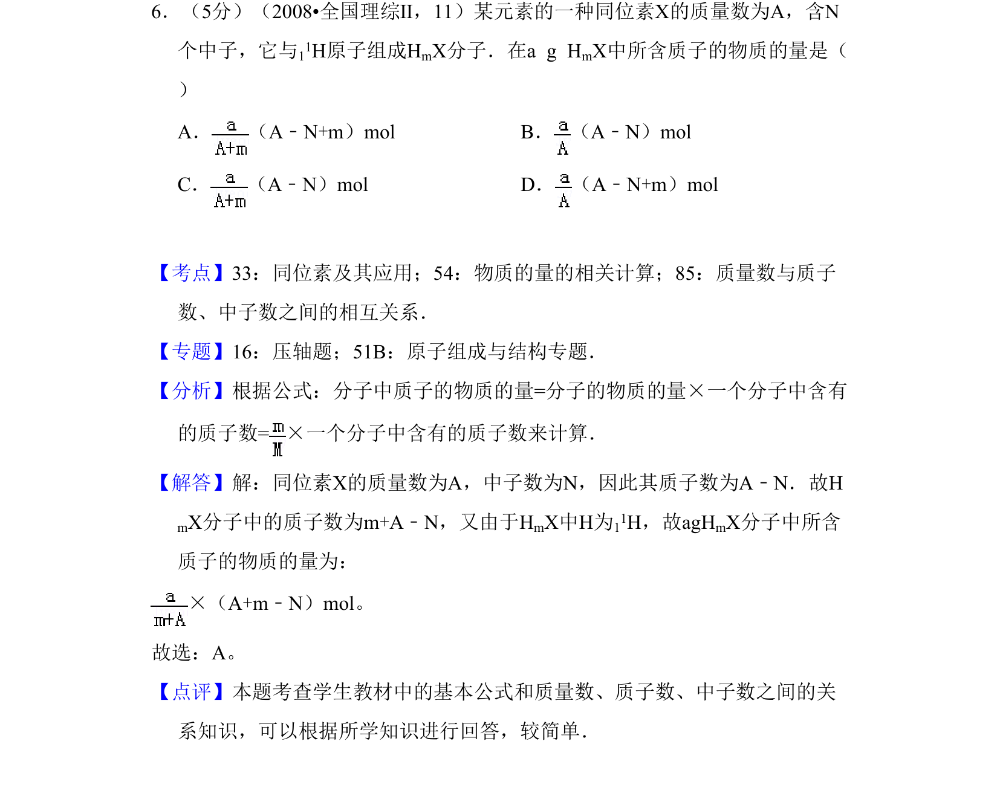
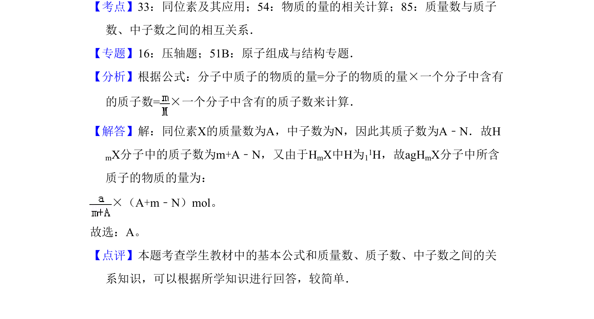

## 题面

## 摘要

考查质量数、中子数、质子数关系及物质的量计算，求一定质量分子中所含质子的物质的量。

## 关联考点

- [[840-质量数|质量数]]
- [[570-质子数|质子数]]
- [[523-中子数|中子数]]
- [[779-物质的量|物质的量]]

## 答案与解析

> 📄 原 PDF 第 5 页：`素材/真题/吉林/2008-2024·（吉林）化学高考真题/2008年高考化学试卷（全国卷Ⅱ）（解析卷）.pdf`
