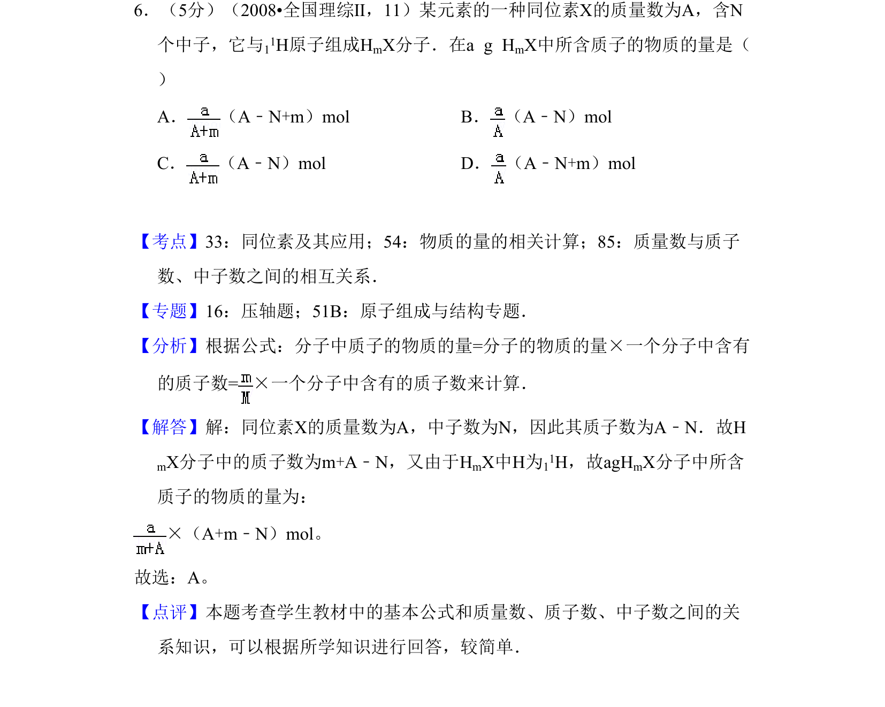
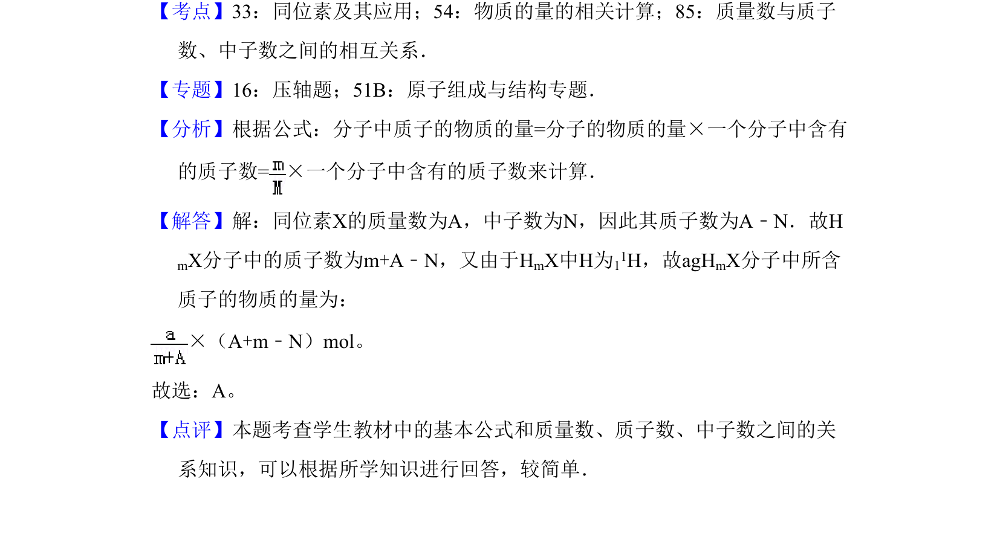

## 题面

## 摘要

考查质量数、中子数、质子数关系及物质的量计算，求一定质量分子中所含质子的物质的量。

## 关联考点

- [[840-质量数|质量数]]
- [[570-质子数|质子数]]
- [[523-中子数|中子数]]
- [[779-物质的量|物质的量]]

## 答案与解析

> 📄 原 PDF 第 5 页：`素材/真题/吉林/2008-2024·（吉林）化学高考真题/2008年高考化学试卷（全国卷Ⅱ）（解析卷）.pdf`

<!-- 题干文本-start -->
## 题干文本
6．（5分）（2008•全国理综Ⅱ，11）某元素的一种同位素X的质量数为A，含N
个中子，它与11H原子组成HmX分子．在a g H mX中所含质子的物质的量是（　　
）
A． （A﹣N+m）mol B． （A﹣N）mol
C． （A﹣N）mol D． （A﹣N+m）mol
<!-- 题干文本-end -->

<!-- 解析文本-start -->
## 解析文本
【考点】33：同位素及其应用；54：物质的量的相关计算；85：质量数与质子
数、中子数之间的相互关系．菁优网版权所有
【专题】16：压轴题；51B：原子组成与结构专题．
【分析】根据公式：分子中质子的物质的量=分子的物质的量×一个分子中含有
的质子数=×一个分子中含有的质子数来计算．
【解答】解：同位素X的质量数为A，中子数为N，因此其质子数为A﹣N．故H
mX分子中的质子数为m+A﹣N，又由于HmX中H为11H，故agHmX分子中所含
质子的物质的量为：
×（A+m﹣N）mol。
故选：A。
【点评】本题考查学生教材中的基本公式和质量数、质子数、中子数之间的关
系知识，可以根据所学知识进行回答，较简单．
<!-- 解析文本-end -->
