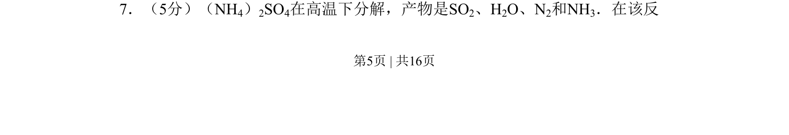
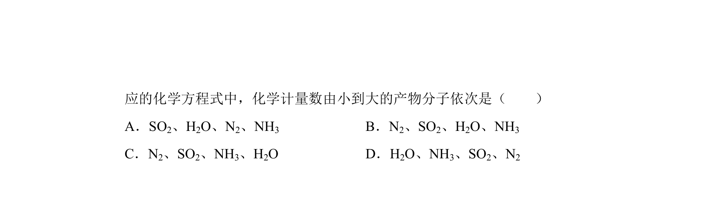
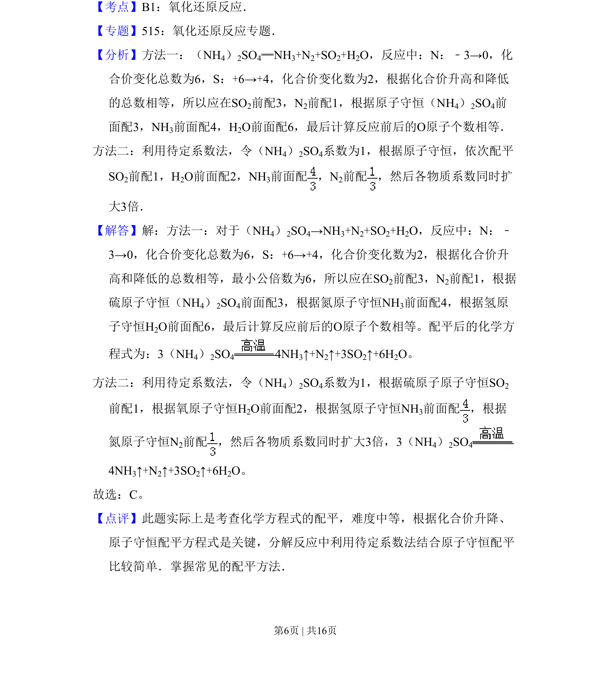

## 题面

## 摘要

该题通过化学方程式配平考查质量守恒定律的应用及简单计算。

## 关联考点

- [[058-质量守恒定律|质量守恒]]
- [[化学计量]]
- [[116-七下-二元一次方程组|方程组]]

## 答案与解析

> 📄 原 PDF 第 5 页：`素材/真题/吉林/2008-2024·（吉林）化学高考真题/2008年高考化学试卷（全国卷Ⅱ）（解析卷）.pdf`
