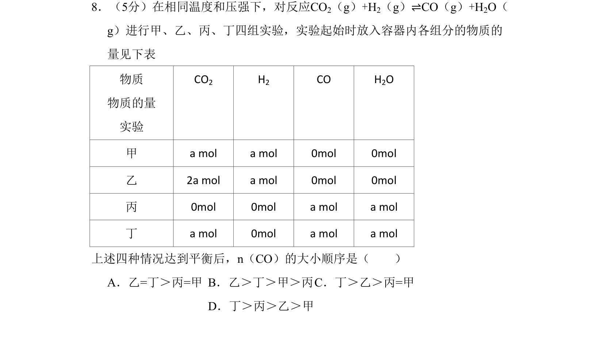
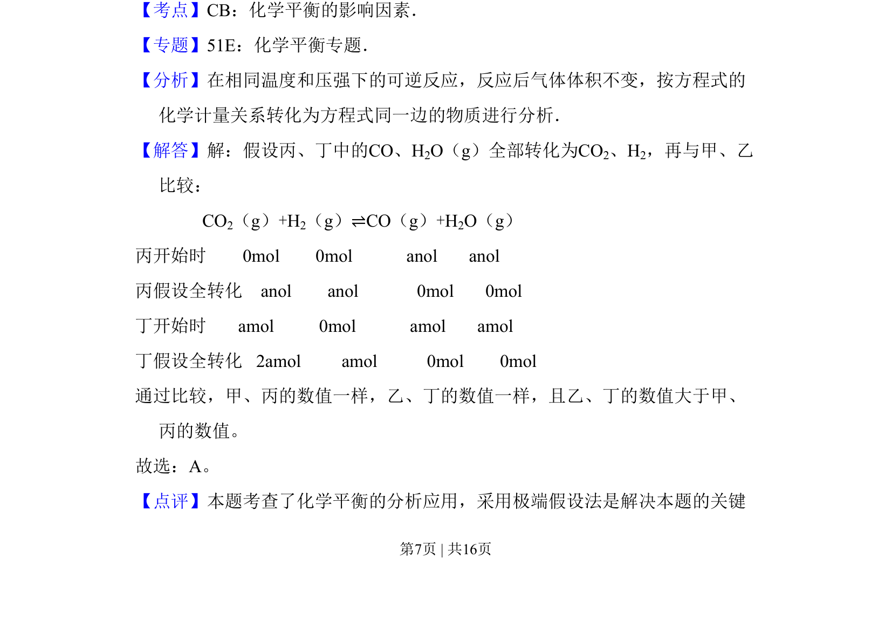
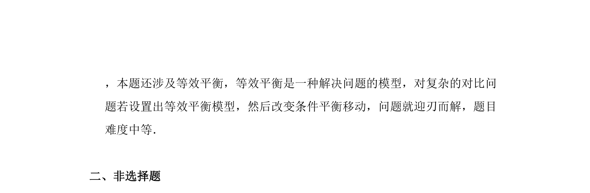

## 题面

## 摘要

该题通过极端假设法比较不同初始投料下化学平衡后CO物质的量大小

## 关联考点

- [[619-化学平衡影响因素|化学平衡影响因素]]
- [[722-极端假设法|极端假设法]]
- [[355-等效平衡|等效平衡]]

## 答案与解析

> 📄 原 PDF 第 7 页：`素材/真题/吉林/2008-2024·（吉林）化学高考真题/2008年高考化学试卷（全国卷Ⅱ）（解析卷）.pdf`

<!-- 题干文本-start -->
## 题干文本
8．（5分）在相同温度和压强下，对反应CO2（g）+H2（g）⇌CO（g）+H2O（
g）进行甲、乙、丙、丁四组实验，实验起始时放入容器内各组分的物质的
量见下表
物质
物质的量
实验
CO2 H2 CO H2O
甲 a mol a mol 0mol 0mol
乙 2a mol a mol 0mol 0mol
丙 0mol 0mol a mol a mol
丁 a mol 0mol a mol a mol
上述四种情况达到平衡后，n（CO）的大小顺序是（　　）
A．乙=丁＞丙=甲B．乙＞丁＞甲＞丙C．丁＞乙＞丙=甲
D．丁＞丙＞乙＞甲
<!-- 题干文本-end -->

<!-- 解析文本-start -->
## 解析文本
【考点】CB：化学平衡的影响因素．菁优网版权所有
【专题】51E：化学平衡专题．
【分析】在相同温度和压强下的可逆反应，反应后气体体积不变，按方程式的
化学计量关系转化为方程式同一边的物质进行分析．
【解答】解：假设丙、丁中的CO、H2O（g）全部转化为CO2、H2，再与甲、乙
比较：
               CO2（g）+H2（g）⇌CO（g）+H2O（g）
丙开始时        0mol        0mol            anol       anol
丙假设全转化    anol        anol             0mol       0mol 
丁开始时       amol          0mol            amol       amol 
丁假设全转化   2amol         amol           0mol        0mol
通过比较，甲、丙的数值一样，乙、丁的数值一样，且乙、丁的数值大于甲、
丙的数值。
故选：A。
【点评】本题考查了化学平衡的分析应用，采用极端假设法是解决本题的关键
<!-- 解析文本-end -->
