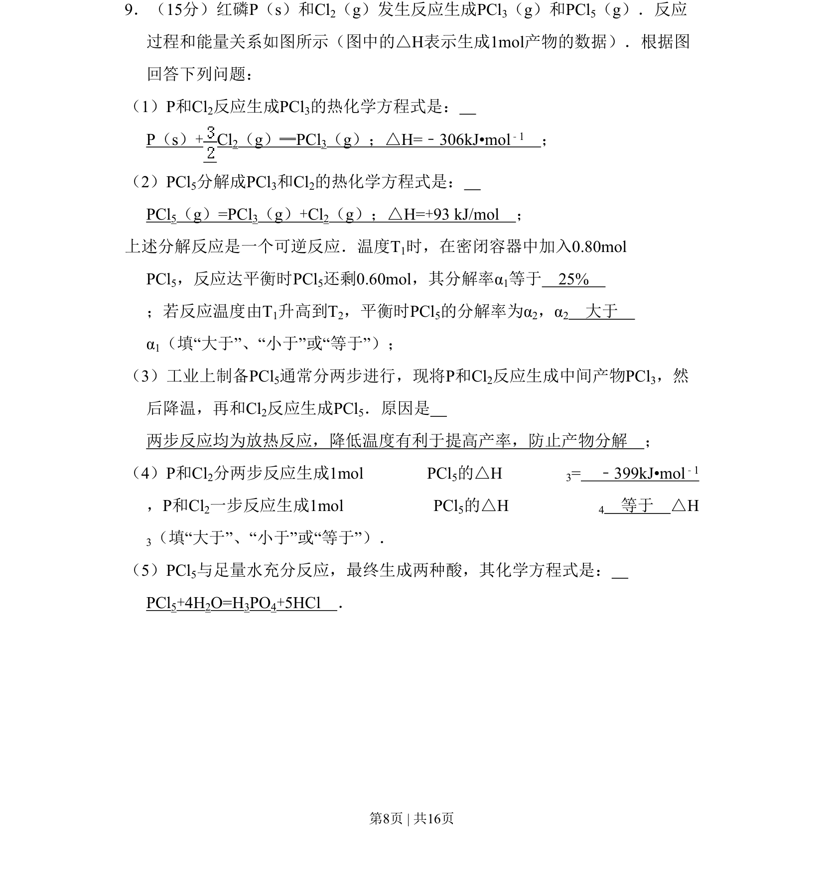
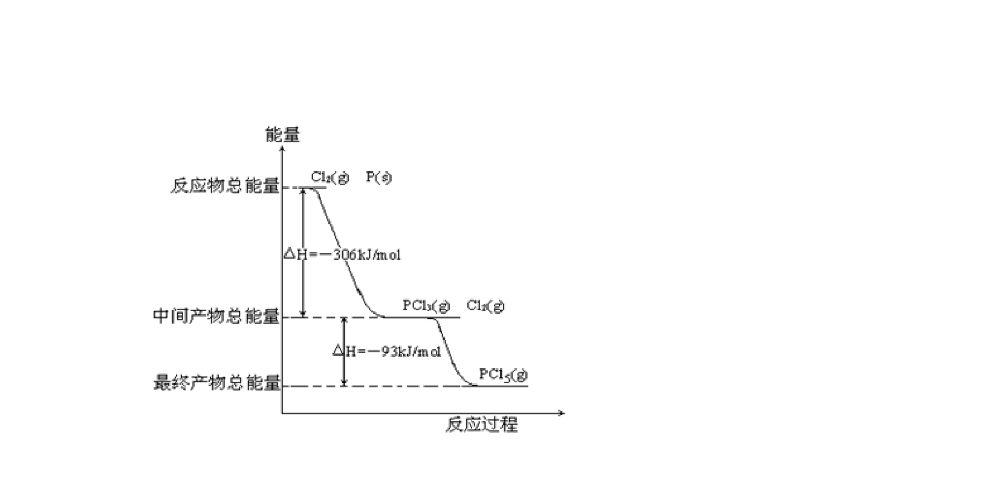
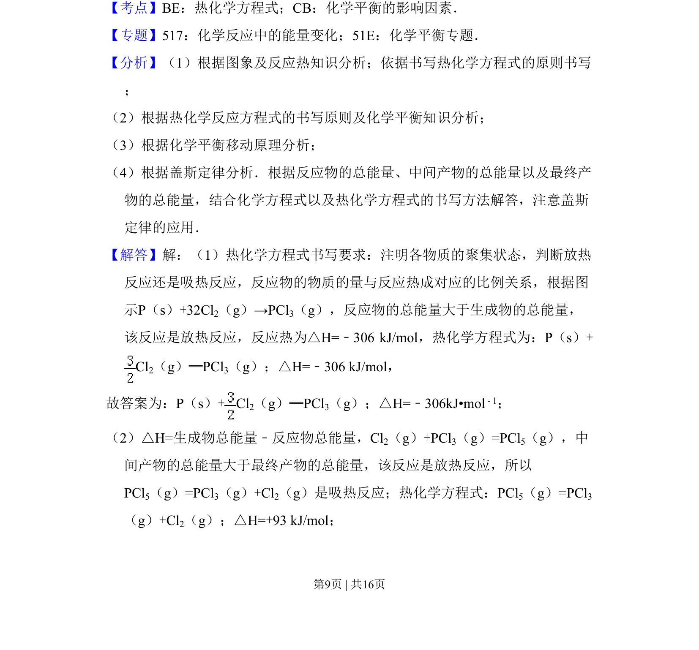
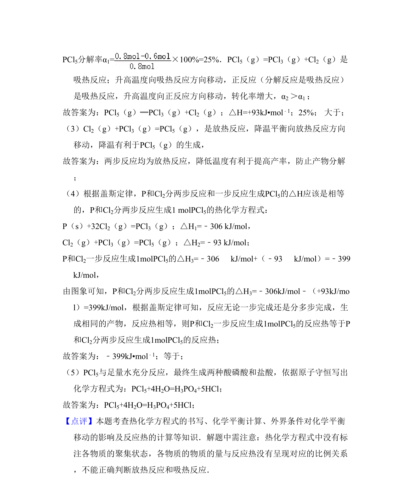

## 题面

## 摘要

该题考查化学反应热效应、热化学方程式书写、可逆反应转化率计算及影响因素。

## 关联考点

- [[309-热化学方程式|热化学方程式]]
- [[288-反应热|反应热]]
- [[284-化学平衡|化学平衡]]
- [[356-转化率|转化率]]

## 答案与解析

> 📄 原 PDF 第 8 页：`素材/真题/吉林/2008-2024·（吉林）化学高考真题/2008年高考化学试卷（全国卷Ⅱ）（解析卷）.pdf`
