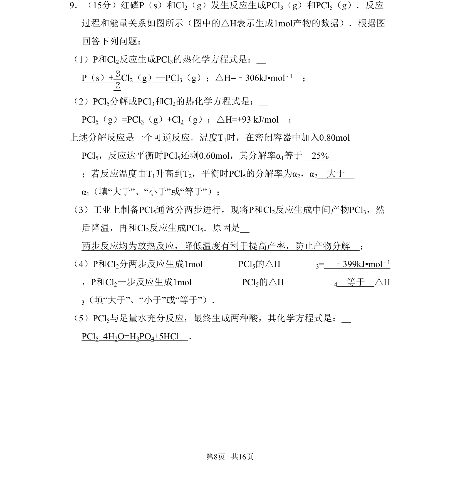
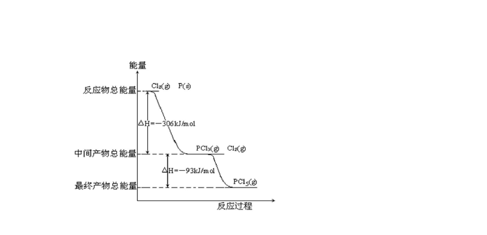
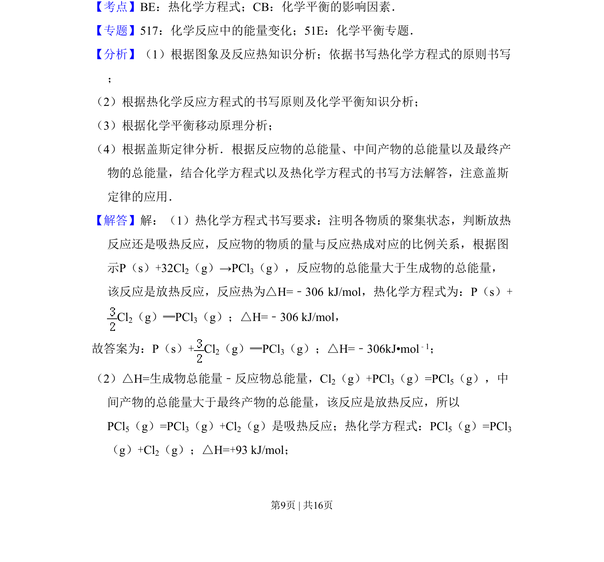
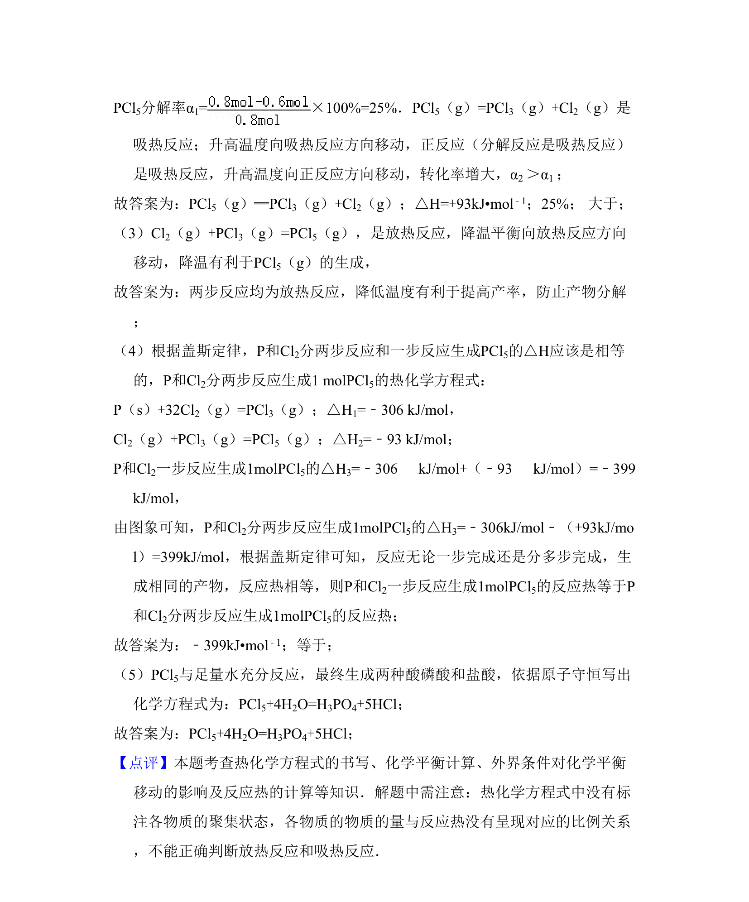

## 题面

## 摘要

该题考查化学反应热效应、热化学方程式书写、可逆反应转化率计算及影响因素。

## 关联考点

- [[309-热化学方程式|热化学方程式]]
- [[288-反应热|反应热]]
- [[284-化学平衡|化学平衡]]
- [[356-转化率|转化率]]

## 答案与解析

> 📄 原 PDF 第 8 页：`素材/真题/吉林/2008-2024·（吉林）化学高考真题/2008年高考化学试卷（全国卷Ⅱ）（解析卷）.pdf`

<!-- 题干文本-start -->
## 题干文本
9．（15分）红磷P（s）和Cl2（g）发生反应生成PCl3（g）和PCl5（g）．反应
过程和能量关系如图所示（图中的△H表示生成1mol产物的数据）．根据图
回答下列问题：
（1）P和Cl2反应生成PCl3的热化学方程式是：　
P（s）+ Cl2（g）═PCl3（g）；△H=﹣306kJ•mol﹣1　；
（2）PCl5分解成PCl3和Cl2的热化学方程式是：　
PCl5（g）=PCl3（g）+Cl2（g）；△H=+93 kJ/mol　；
上述分解反应是一个可逆反应．温度T1时，在密闭容器中加入0.80mol 
PCl5，反应达平衡时PCl5还剩0.60mol，其分解率α1等于　25%　
；若反应温度由T1升高到T2，平衡时PCl5的分解率为α2，α2　大于　
α1（填“大于”、“小于”或“等于”）；
（3）工业上制备PCl5通常分两步进行，现将P和Cl2反应生成中间产物PCl3，然
后降温，再和Cl2反应生成PCl5．原因是　
两步反应均为放热反应，降低温度有利于提高产率，防止产物分解　；
（4）P和Cl2分两步反应生成1mol PCl 5的△H 3=　﹣399kJ•mol﹣1　
，P和Cl2一步反应生成1mol PCl 5的△H 4　等于　△H 
3（填“大于”、“小于”或“等于”）．
（5）PCl5与足量水充分反应，最终生成两种酸，其化学方程式是：　
PCl5+4H2O=H3PO4+5HCl　．
<!-- 题干文本-end -->

<!-- 解析文本-start -->
## 解析文本

<!-- 解析文本-end -->
