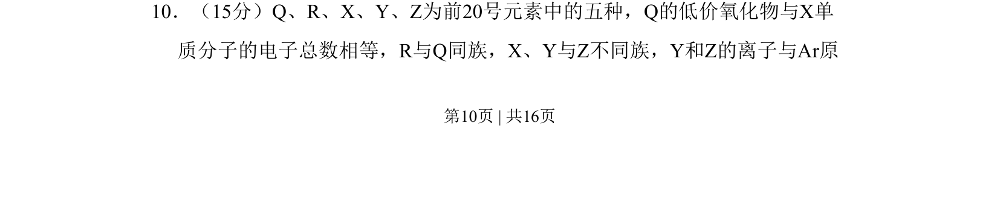
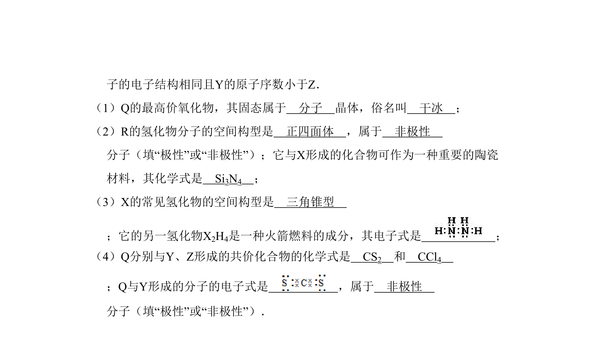
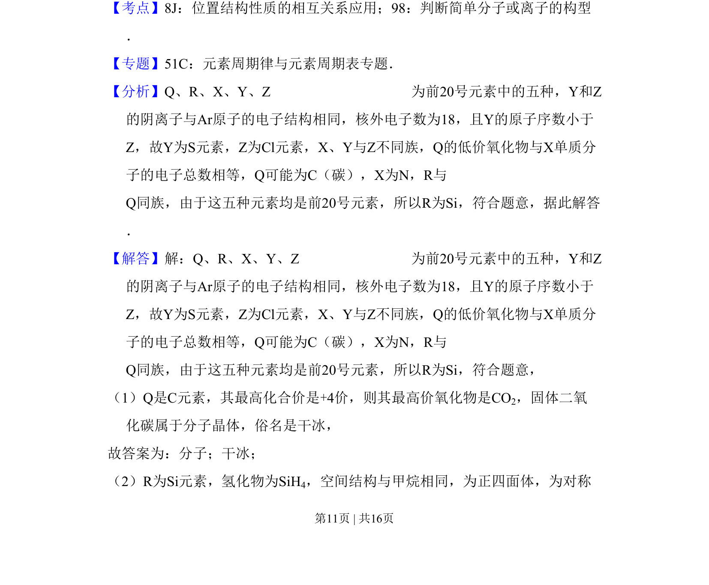
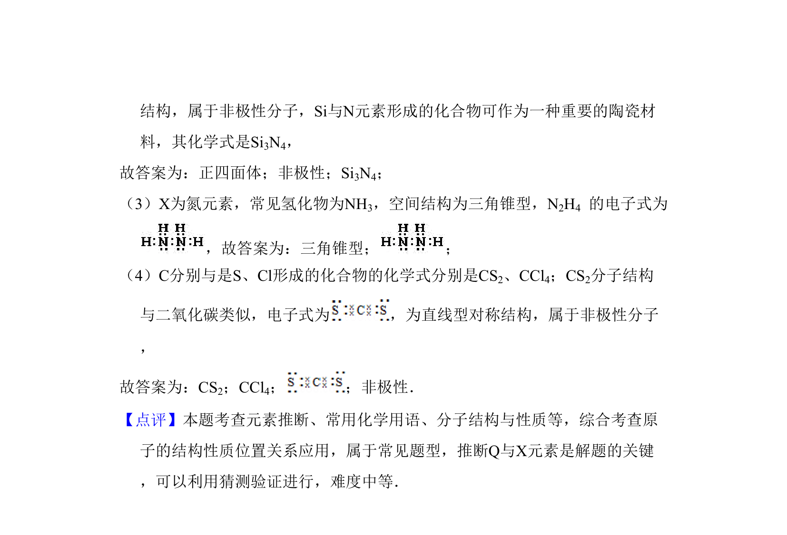

## 题面

## 摘要

本题通过元素原子结构、电子总数及周期表位置推断Q、R、X、Y、Z五种元素，并考查相关性质。

## 关联考点

- [[597-元素推断|元素推断]]
- [[892-电子总数|电子总数]]
- [[426-原子结构|原子结构]]
- [[897-离子电子排布|离子电子排布]]

## 答案与解析

> 📄 原 PDF 第 10 页：`素材/真题/吉林/2008-2024·（吉林）化学高考真题/2008年高考化学试卷（全国卷Ⅱ）（解析卷）.pdf`
