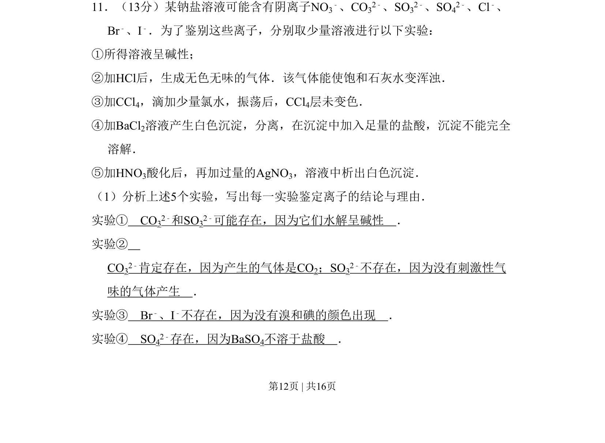
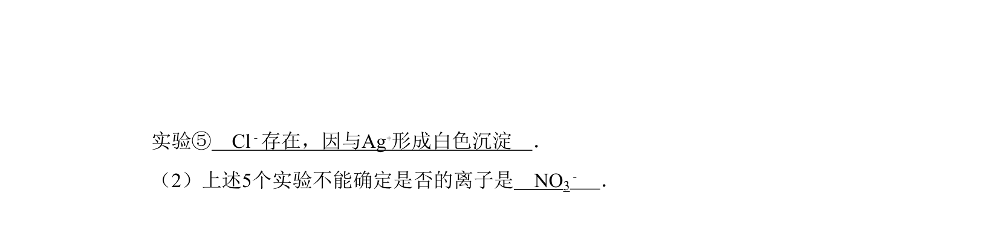
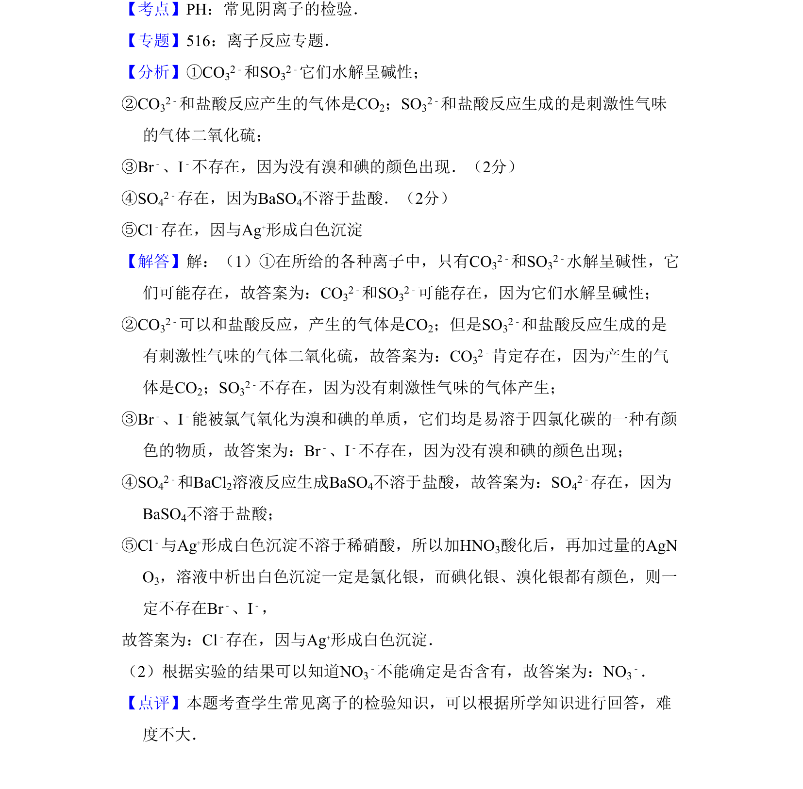

## 题面

## 摘要

通过五个实验现象推断溶液中存在的阴离子种类。

## 关联考点

- [[563-离子共存|离子共存]]
- [[541-实验推理|实验推理]]
- [[629-化学鉴别|化学鉴别]]

## 答案与解析

> 📄 原 PDF 第 12 页：`素材/真题/吉林/2008-2024·（吉林）化学高考真题/2008年高考化学试卷（全国卷Ⅱ）（解析卷）.pdf`

<!-- 题干文本-start -->
## 题干文本
11．（13分）某钠盐溶液可能含有阴离子NO3
﹣、CO32﹣、SO32﹣、SO42﹣、Cl﹣、
Br﹣、I﹣．为了鉴别这些离子，分别取少量溶液进行以下实验：
①所得溶液呈碱性；
②加HCl后，生成无色无味的气体．该气体能使饱和石灰水变浑浊．
③加CCl4，滴加少量氯水，振荡后，CCl4层未变色．
④加BaCl2溶液产生白色沉淀，分离，在沉淀中加入足量的盐酸，沉淀不能完全
溶解．
⑤加HNO3酸化后，再加过量的AgNO3，溶液中析出白色沉淀．
（1）分析上述5个实验，写出每一实验鉴定离子的结论与理由．
实验①　CO32﹣和SO32﹣可能存在，因为它们水解呈碱性　．
实验②　
CO32﹣肯定存在，因为产生的气体是CO2；SO32﹣不存在，因为没有刺激性气
味的气体产生　．
实验③　Br﹣、I﹣不存在，因为没有溴和碘的颜色出现　．
实验④　SO42﹣存在，因为BaSO4不溶于盐酸　．
<!-- 题干文本-end -->

<!-- 解析文本-start -->
## 解析文本

<!-- 解析文本-end -->
