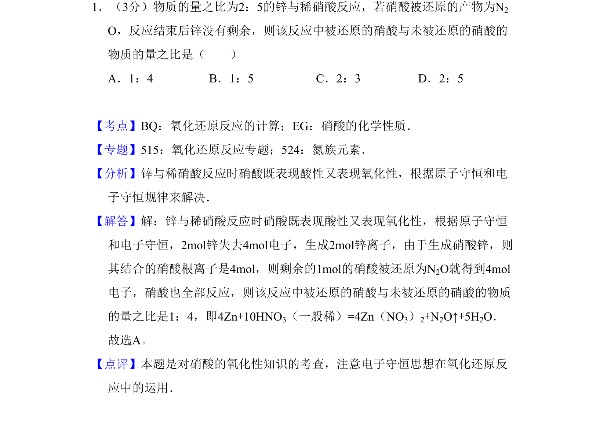
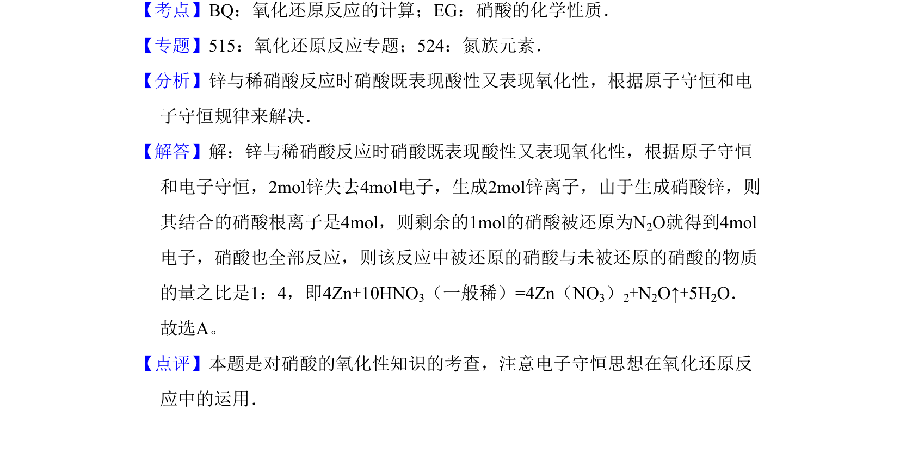

## 题面

## 摘要

锌与稀硝酸反应中硝酸作用的计算

## 关联考点

- [[733-氧化还原反应的计算|氧化还原反应计算]]
- [[560-电子守恒|电子守恒]]
- [[880-原子守恒|原子守恒]]

## 答案与解析

> 📄 原 PDF 第 1 页：`素材/真题/吉林/2008-2024·（吉林）化学高考真题/2009年高考化学试卷（全国卷Ⅱ）（解析卷）.pdf`

<!-- 题干文本-start -->
## 题干文本
1．（3分）物质的量之比为2：5的锌与稀硝酸反应，若硝酸被还原的产物为N2
O，反应结束后锌没有剩余，则该反应中被还原的硝酸与未被还原的硝酸的
物质的量之比是（　　）
A．1：4 B．1：5 C．2：3 D．2：5
<!-- 题干文本-end -->

<!-- 解析文本-start -->
## 解析文本
【考点】BQ：氧化还原反应的计算；EG：硝酸的化学性质．菁优网版权所有
【专题】515：氧化还原反应专题；524：氮族元素．
【分析】锌与稀硝酸反应时硝酸既表现酸性又表现氧化性，根据原子守恒和电
子守恒规律来解决．
【解答】解：锌与稀硝酸反应时硝酸既表现酸性又表现氧化性，根据原子守恒
和电子守恒，2mol锌失去4mol电子，生成2mol锌离子，由于生成硝酸锌，则
其结合的硝酸根离子是4mol，则剩余的1mol的硝酸被还原为N2O就得到4mol
电子，硝酸也全部反应，则该反应中被还原的硝酸与未被还原的硝酸的物质
的量之比是1：4，即4Zn+10HNO3（一般稀）=4Zn（NO3）2+N2O↑+5H2O．
故选A。
【点评】本题是对硝酸的氧化性知识的考查，注意电子守恒思想在氧化还原反
应中的运用．
<!-- 解析文本-end -->
