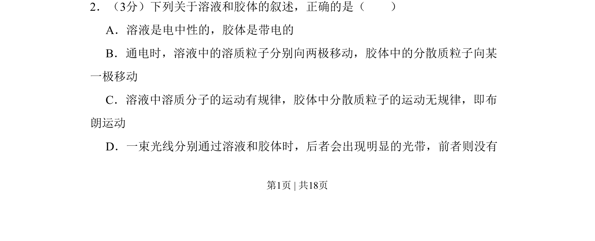
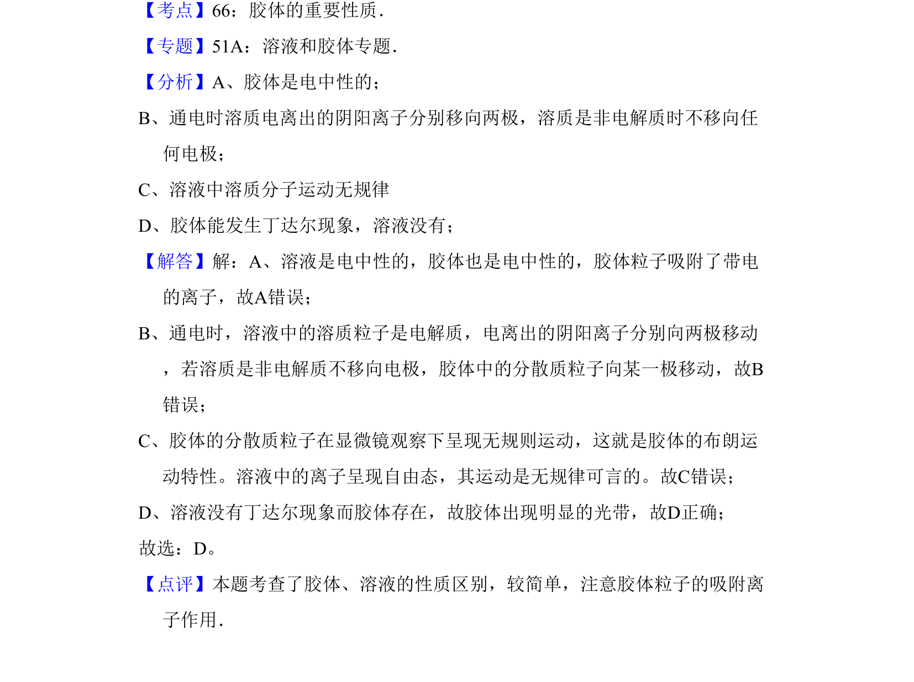

## 题面

## 摘要

本题考查溶液和胶体的性质差异，重点辨析电性、通电后粒子移动及丁达尔效应等典型特征。

## 关联考点

- [[083-溶液|溶液]]
- [[172-胶体|胶体]]
- [[电泳]]
- [[151-丁达尔效应|丁达尔效应]]

## 答案与解析

> 📄 原 PDF 第 1 页：`素材/真题/吉林/2008-2024·（吉林）化学高考真题/2009年高考化学试卷（全国卷Ⅱ）（解析卷）.pdf`
