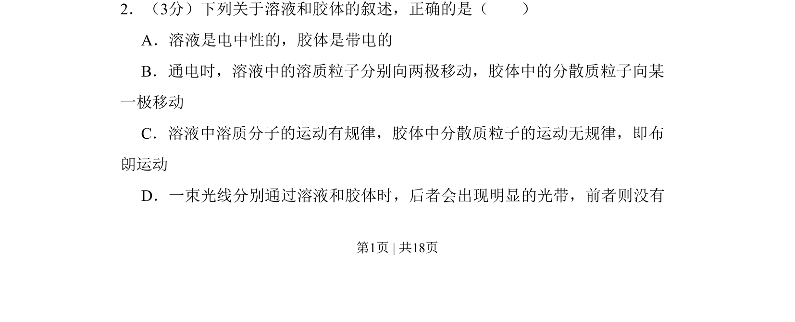
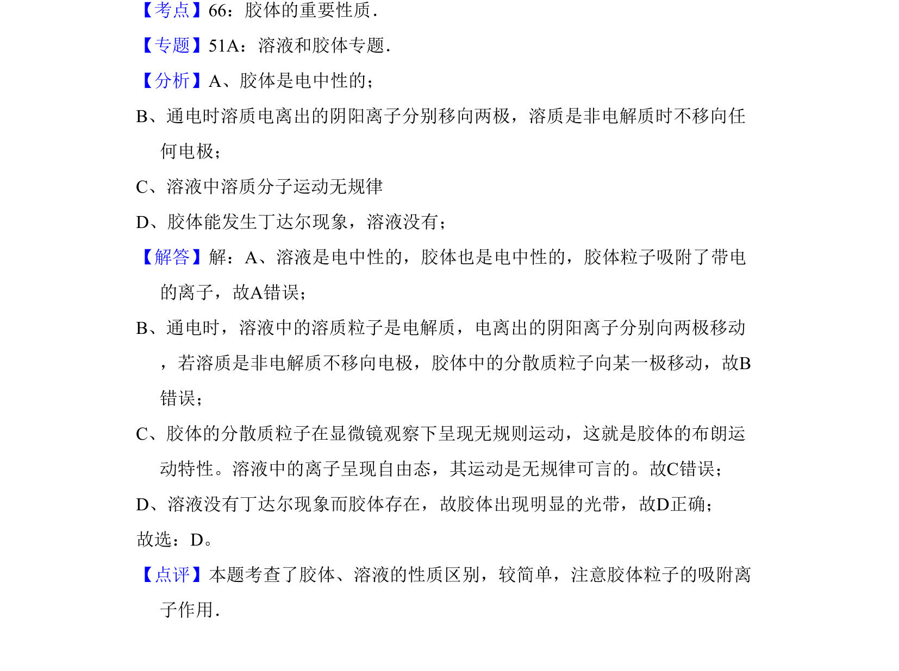

## 题面

## 摘要

本题考查溶液和胶体的性质差异，重点辨析电性、通电后粒子移动及丁达尔效应等典型特征。

## 关联考点

- [[083-溶液|溶液]]
- [[172-胶体|胶体]]
- [[795-电泳|电泳]]
- [[151-丁达尔效应|丁达尔效应]]

## 答案与解析

> 📄 原 PDF 第 1 页：`素材/真题/吉林/2008-2024·（吉林）化学高考真题/2009年高考化学试卷（全国卷Ⅱ）（解析卷）.pdf`

<!-- 题干文本-start -->
## 题干文本
2．（3分）下列关于溶液和胶体的叙述，正确的是（　　）
A．溶液是电中性的，胶体是带电的
B．通电时，溶液中的溶质粒子分别向两极移动，胶体中的分散质粒子向某
一极移动
C．溶液中溶质分子的运动有规律，胶体中分散质粒子的运动无规律，即布
朗运动
D．一束光线分别通过溶液和胶体时，后者会出现明显的光带，前者则没有
<!-- 题干文本-end -->

<!-- 解析文本-start -->
## 解析文本

<!-- 解析文本-end -->
