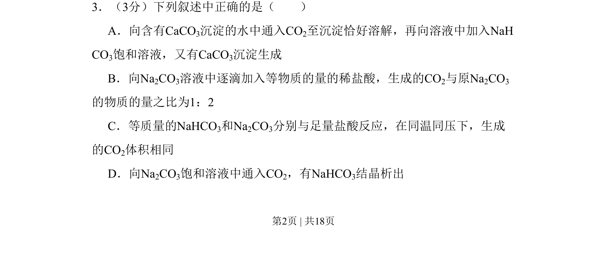
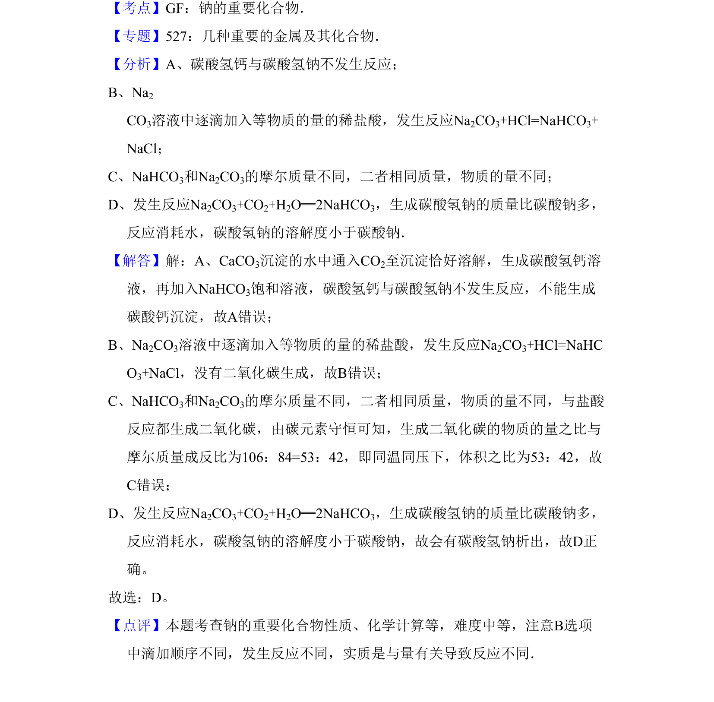

## 题面

## 摘要

考查碳酸盐、碳酸氢盐的溶解性、转化及与酸和二氧化碳的反应规律。

## 关联考点

- [[328-沉淀溶解平衡|沉淀溶解平衡]]
- [[802-碳酸盐与碳酸氢盐转化|碳酸盐与碳酸氢盐转化]]
- [[589-二氧化碳与盐反应|二氧化碳与盐反应]]
- [[573-钠盐性质比较|钠盐性质比较]]

## 答案与解析

> 📄 原 PDF 第 2 页：`素材/真题/吉林/2008-2024·（吉林）化学高考真题/2009年高考化学试卷（全国卷Ⅱ）（解析卷）.pdf`
