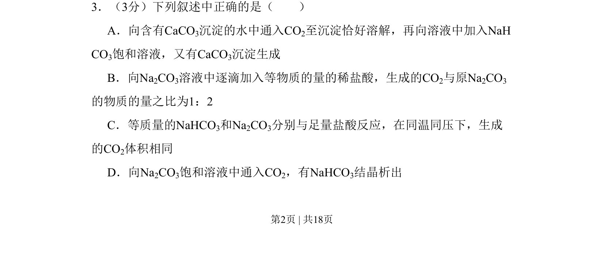
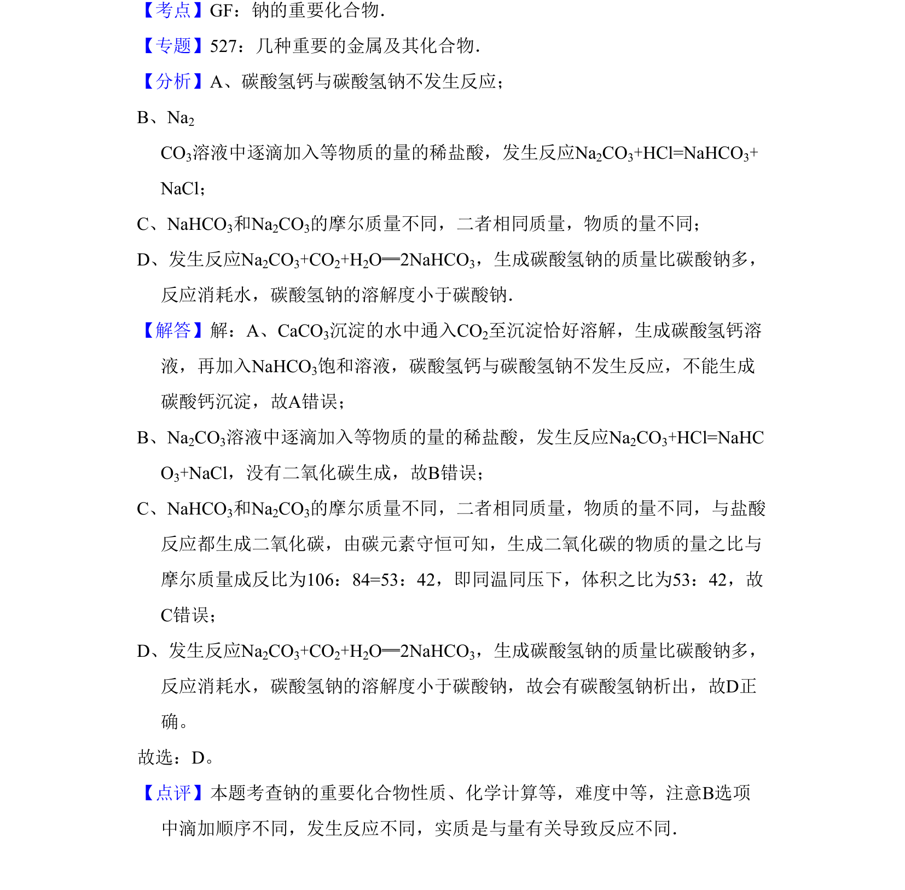

## 题面

## 摘要

考查碳酸盐、碳酸氢盐的溶解性、转化及与酸和二氧化碳的反应规律。

## 关联考点

- [[328-沉淀溶解平衡|沉淀溶解平衡]]
- [[802-碳酸盐与碳酸氢盐转化|碳酸盐与碳酸氢盐转化]]
- [[589-二氧化碳与盐反应|二氧化碳与盐反应]]
- [[573-钠盐性质比较|钠盐性质比较]]

## 答案与解析

> 📄 原 PDF 第 2 页：`素材/真题/吉林/2008-2024·（吉林）化学高考真题/2009年高考化学试卷（全国卷Ⅱ）（解析卷）.pdf`

<!-- 题干文本-start -->
## 题干文本
3．（3分）下列叙述中正确的是（　　）
A．向含有CaCO3沉淀的水中通入CO2至沉淀恰好溶解，再向溶液中加入NaH
CO3饱和溶液，又有CaCO3沉淀生成
B．向Na2CO3溶液中逐滴加入等物质的量的稀盐酸，生成的CO2与原Na2CO3
的物质的量之比为1：2
C．等质量的NaHCO3和Na2CO3分别与足量盐酸反应，在同温同压下，生成
的CO2体积相同
D．向Na2CO3饱和溶液中通入CO2，有NaHCO3结晶析出
<!-- 题干文本-end -->

<!-- 解析文本-start -->
## 解析文本

<!-- 解析文本-end -->
