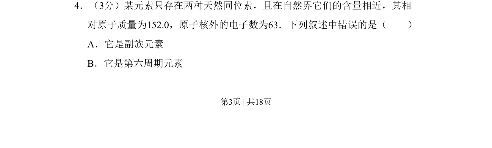
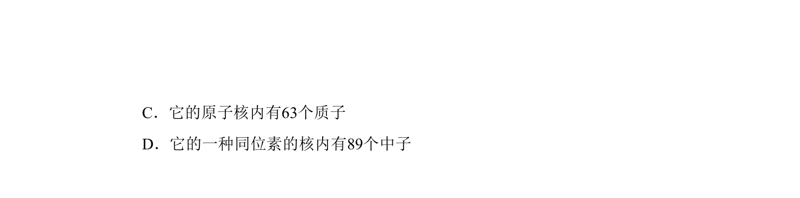
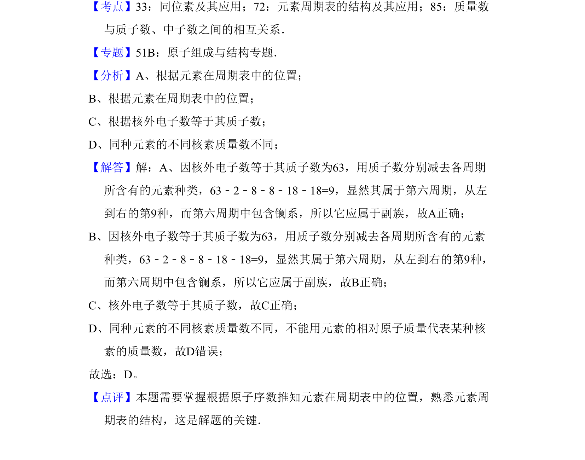

## 题面

## 摘要

本题考查根据核外电子数和相对原子质量推断元素周期表位置及性质。

## 关联考点

- [[253-元素周期表|元素周期表]]
- [[035-相对原子质量|相对原子质量]]
- [[032-原子结构|核外电子排布]]

## 答案与解析

> 📄 原 PDF 第 3 页：`素材/真题/吉林/2008-2024·（吉林）化学高考真题/2009年高考化学试卷（全国卷Ⅱ）（解析卷）.pdf`
