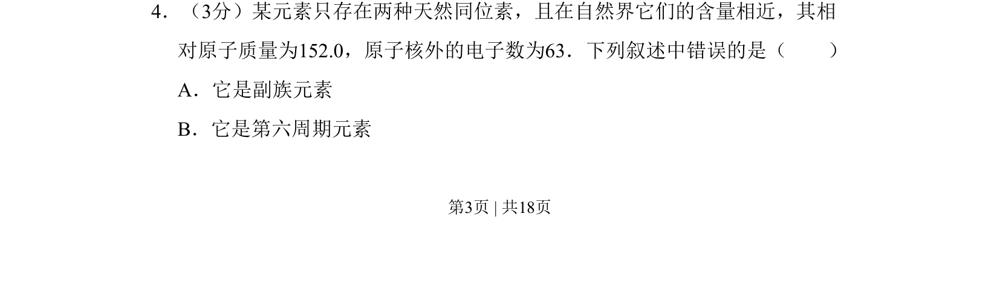
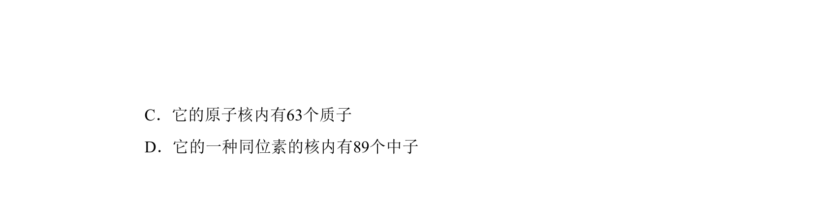
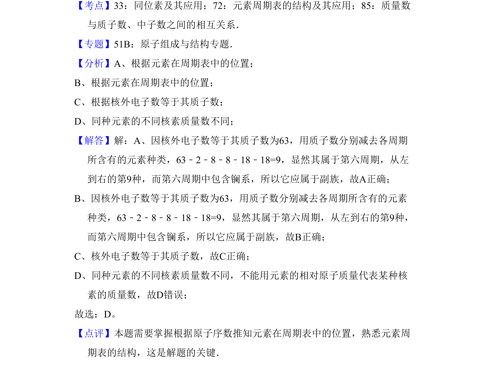

## 题面

## 摘要

本题考查根据核外电子数和相对原子质量推断元素周期表位置及性质。

## 关联考点

- [[253-元素周期表|元素周期表]]
- [[035-相对原子质量|相对原子质量]]
- [[032-原子结构|核外电子排布]]

## 答案与解析

> 📄 原 PDF 第 3 页：`素材/真题/吉林/2008-2024·（吉林）化学高考真题/2009年高考化学试卷（全国卷Ⅱ）（解析卷）.pdf`

<!-- 题干文本-start -->
## 题干文本
4．（3分）某元素只存在两种天然同位素，且在自然界它们的含量相近，其相
对原子质量为152.0，原子核外的电子数为63．下列叙述中错误的是（　　）
A．它是副族元素
B．它是第六周期元素
<!-- 题干文本-end -->

<!-- 解析文本-start -->
## 解析文本

<!-- 解析文本-end -->
