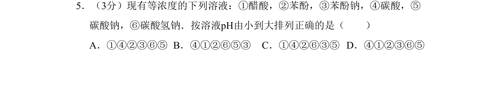
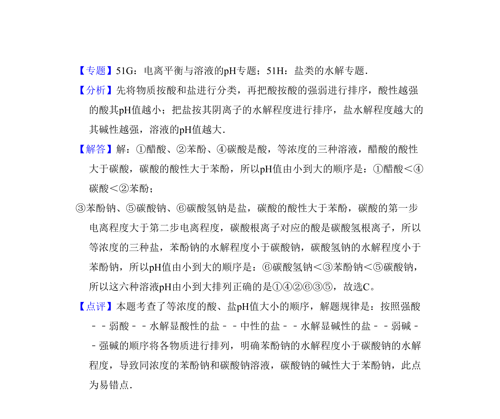

## 题面

## 摘要

该题考查弱电解质电离与盐类水解对溶液pH的影响，要求比较不同溶液的酸碱性强弱。

## 关联考点

- [[544-弱电解质电离平衡|弱电解质电离平衡]]
- [[336-盐类水解|盐类水解]]

## 答案与解析

> 📄 原 PDF 第 4 页：`素材/真题/吉林/2008-2024·（吉林）化学高考真题/2009年高考化学试卷（全国卷Ⅱ）（解析卷）.pdf`
