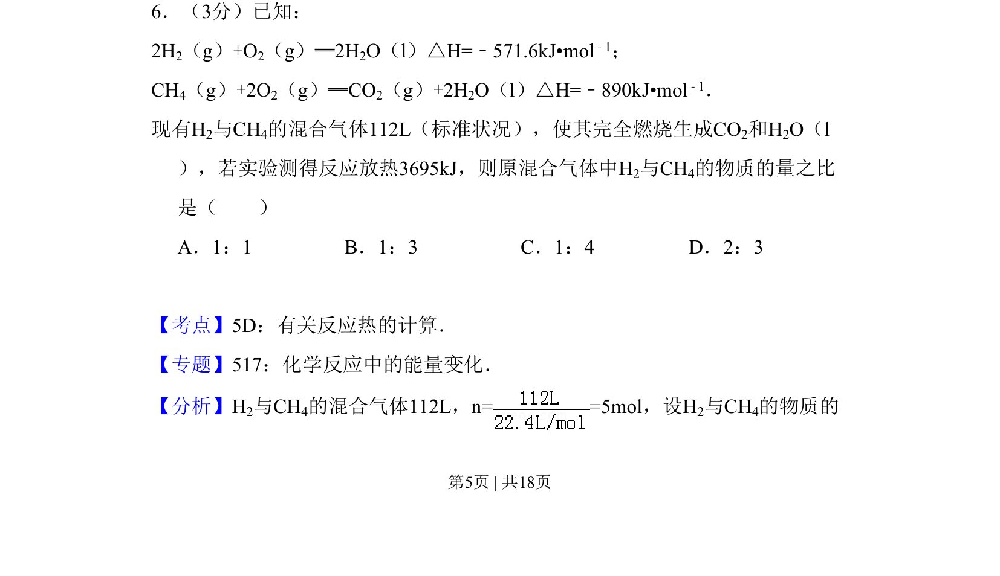
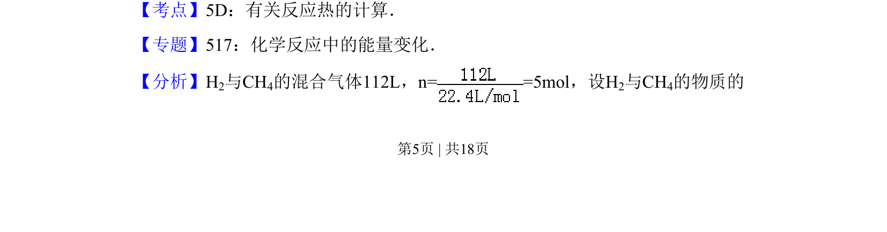
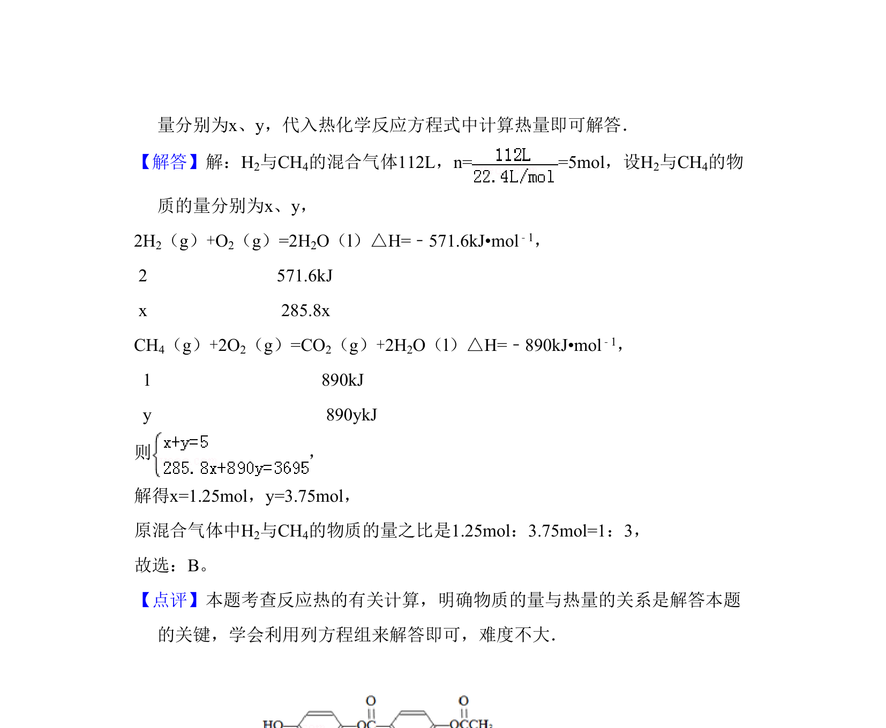

## 题面

## 摘要

本题考查热化学方程式与反应热的计算，通过混合气体燃烧放热数据求物质的量之比。

## 关联考点

- [[有关反应热的计算]]
- [[309-热化学方程式|热化学方程式]]
- [[物质的量计算]]

## 答案与解析

> 📄 原 PDF 第 5 页：`素材/真题/吉林/2008-2024·（吉林）化学高考真题/2009年高考化学试卷（全国卷Ⅱ）（解析卷）.pdf`
