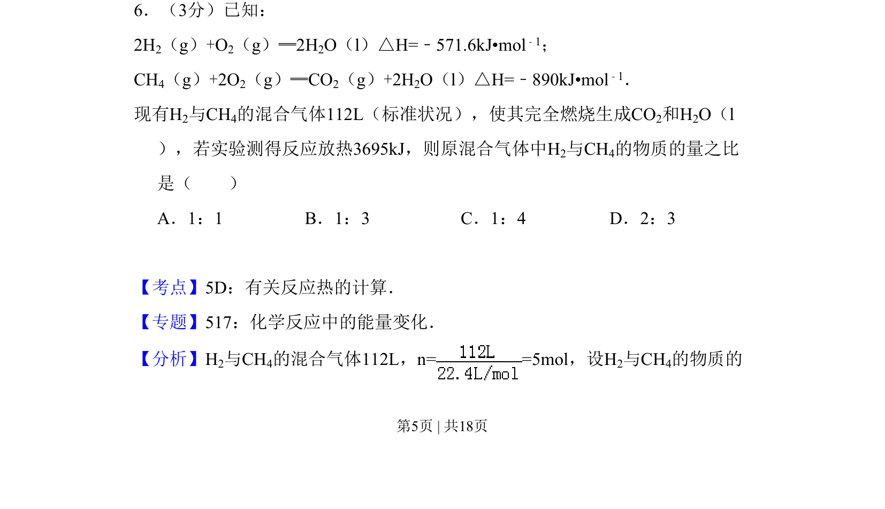
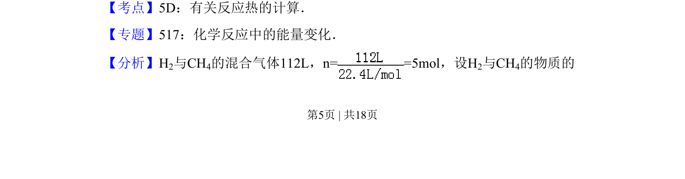
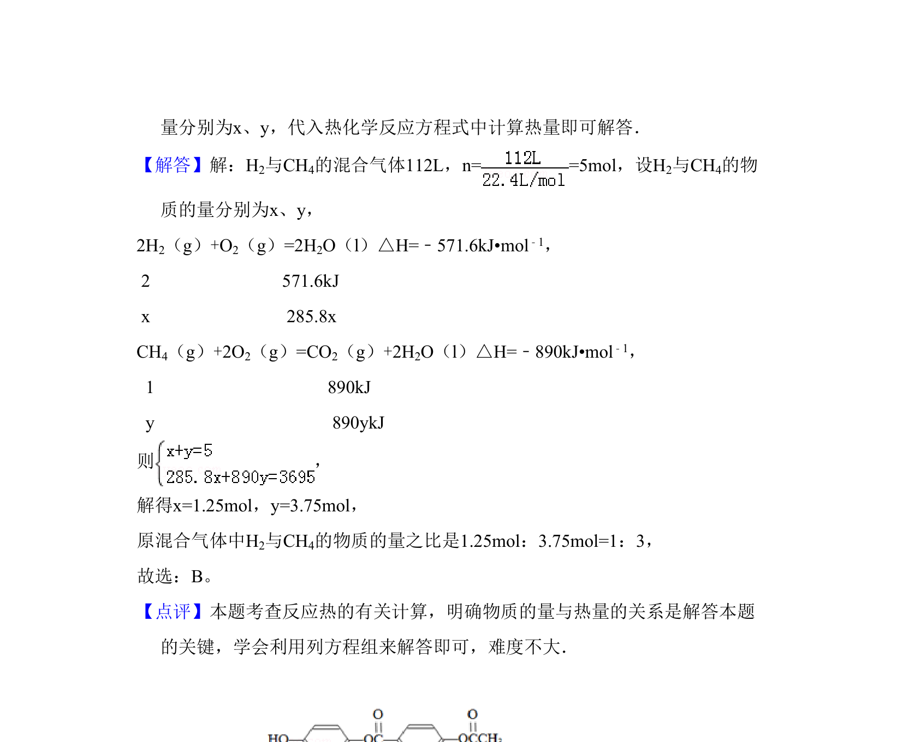

## 题面

## 摘要

本题考查热化学方程式与反应热的计算，通过混合气体燃烧放热数据求物质的量之比。

## 关联考点

- [[704-有关反应热的计算|有关反应热的计算]]
- [[309-热化学方程式|热化学方程式]]
- [[689-微粒数计算|物质的量计算]]

## 答案与解析

> 📄 原 PDF 第 5 页：`素材/真题/吉林/2008-2024·（吉林）化学高考真题/2009年高考化学试卷（全国卷Ⅱ）（解析卷）.pdf`

<!-- 题干文本-start -->
## 题干文本
6．（3分）已知：
2H2（g）+O2（g）═2H2O（l）△H=﹣571.6kJ•mol﹣1；
CH4（g）+2O2（g）═CO2（g）+2H2O（l）△H=﹣890kJ•mol﹣1．
现有H2与CH4的混合气体112L（标准状况），使其完全燃烧生成CO2和H2O（l
），若实验测得反应放热3695kJ，则原混合气体中H2与CH4的物质的量之比
是（　　）
A．1：1 B．1：3 C．1：4 D．2：3
<!-- 题干文本-end -->

<!-- 解析文本-start -->
## 解析文本
【考点】5D：有关反应热的计算．菁优网版权所有
【专题】517：化学反应中的能量变化．
【分析】H2与CH4的混合气体112L，n= =5mol，设H 2与CH4的物质的
<!-- 解析文本-end -->
