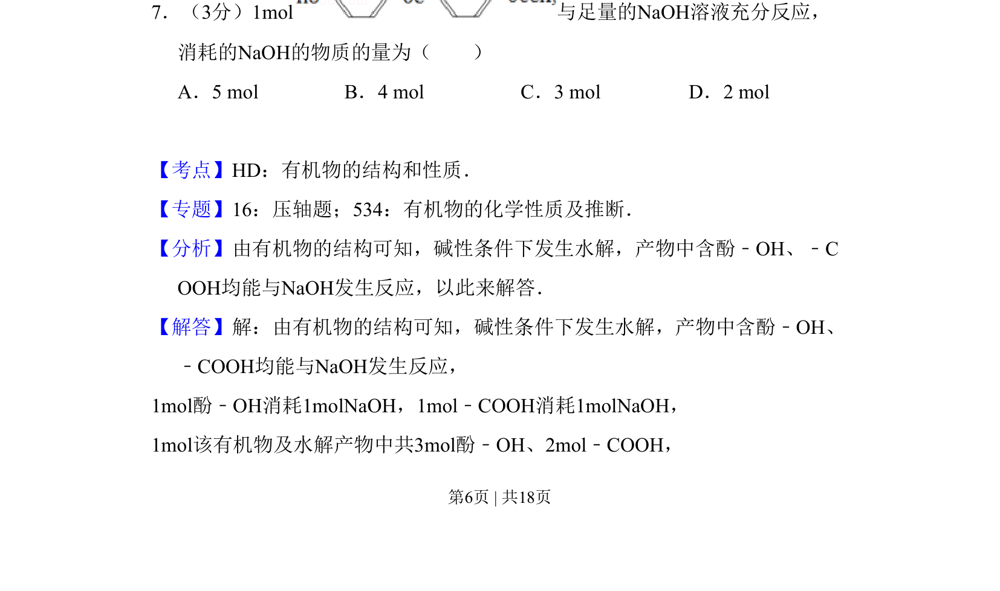
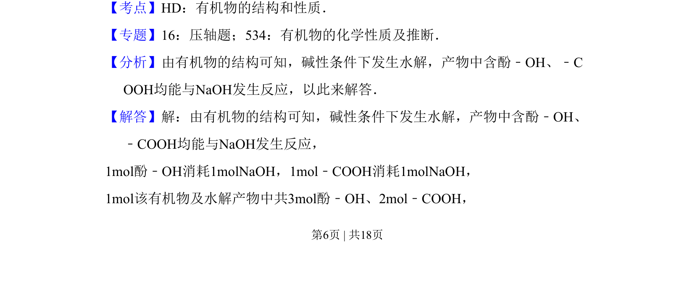
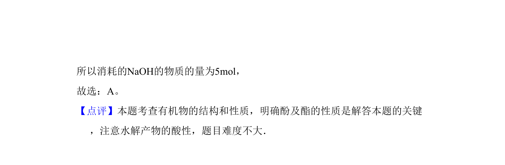

## 题面

## 摘要

该题考查有机物在碱性条件下的水解反应及酚羟基、羧基与氢氧化钠的定量反应计算。

## 关联考点

- [[714-有机物的结构和性质|有机物的结构和性质]]
- [[742-水解反应|水解反应]]
- [[848-酚羟基|酚羟基]]
- [[822-羧基|羧基]]

## 答案与解析

> 📄 原 PDF 第 6 页：`素材/真题/吉林/2008-2024·（吉林）化学高考真题/2009年高考化学试卷（全国卷Ⅱ）（解析卷）.pdf`
