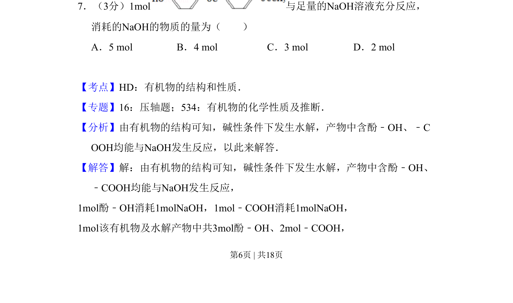
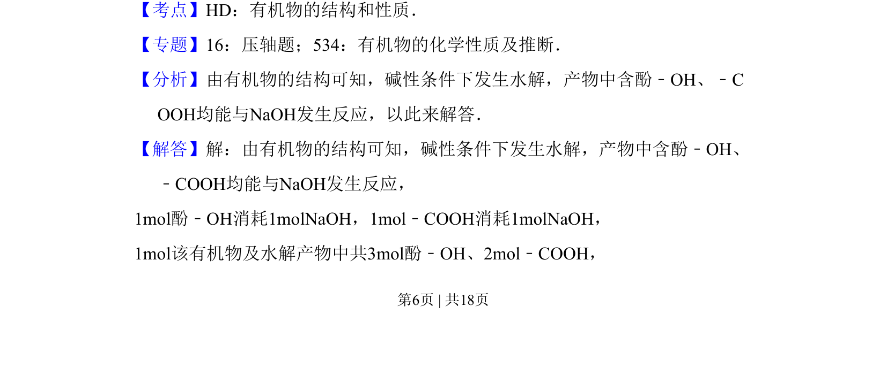
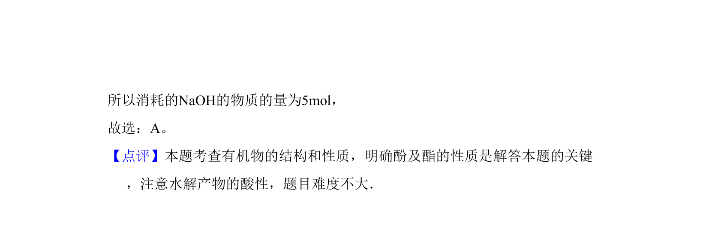

## 题面

## 摘要

该题考查有机物在碱性条件下的水解反应及酚羟基、羧基与氢氧化钠的定量反应计算。

## 关联考点

- [[714-有机物的结构和性质|有机物的结构和性质]]
- [[742-水解反应|水解反应]]
- [[848-酚羟基|酚羟基]]
- [[822-羧基|羧基]]

## 答案与解析

> 📄 原 PDF 第 6 页：`素材/真题/吉林/2008-2024·（吉林）化学高考真题/2009年高考化学试卷（全国卷Ⅱ）（解析卷）.pdf`

<!-- 题干文本-start -->
## 题干文本
7．（3分）1mol与足量的NaOH溶液充分反应，
消耗的NaOH的物质的量为（　　）
A．5 mol B．4 mol C．3 mol D．2 mol
<!-- 题干文本-end -->

<!-- 解析文本-start -->
## 解析文本
【考点】HD：有机物的结构和性质．菁优网版权所有
【专题】16：压轴题；534：有机物的化学性质及推断．
【分析】由有机物的结构可知，碱性条件下发生水解，产物中含酚﹣OH、﹣C
OOH均能与NaOH发生反应，以此来解答．
【解答】解：由有机物的结构可知，碱性条件下发生水解，产物中含酚﹣OH、
﹣COOH均能与NaOH发生反应，
1mol酚﹣OH消耗1molNaOH，1mol﹣COOH消耗1molNaOH，
1mol该有机物及水解产物中共3mol酚﹣OH、2mol﹣COOH，
<!-- 解析文本-end -->
