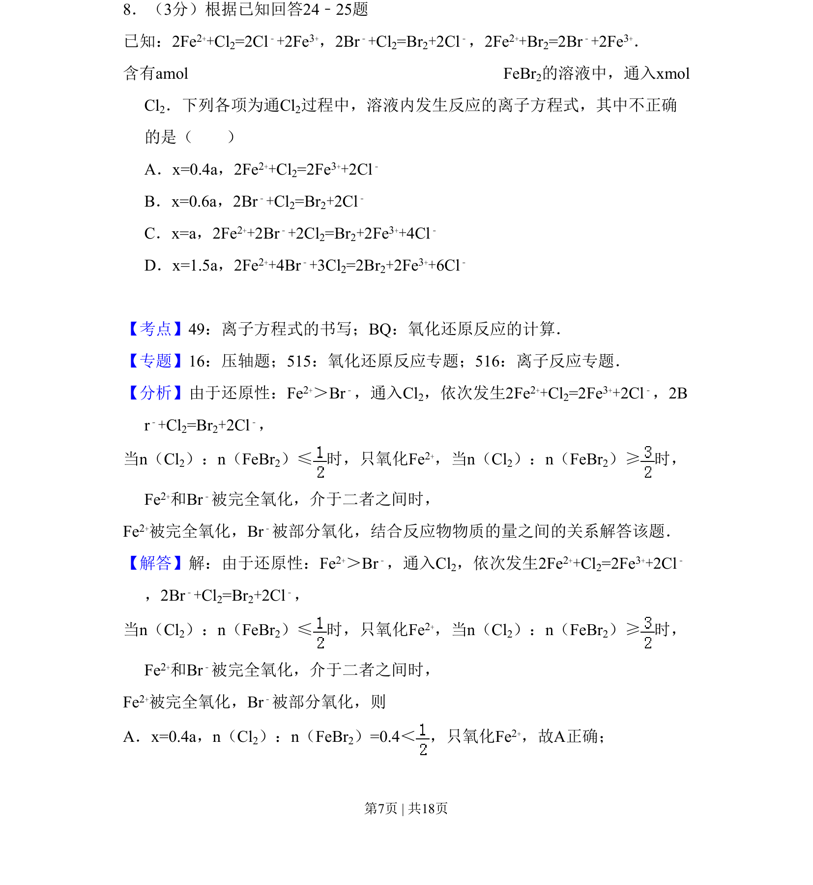
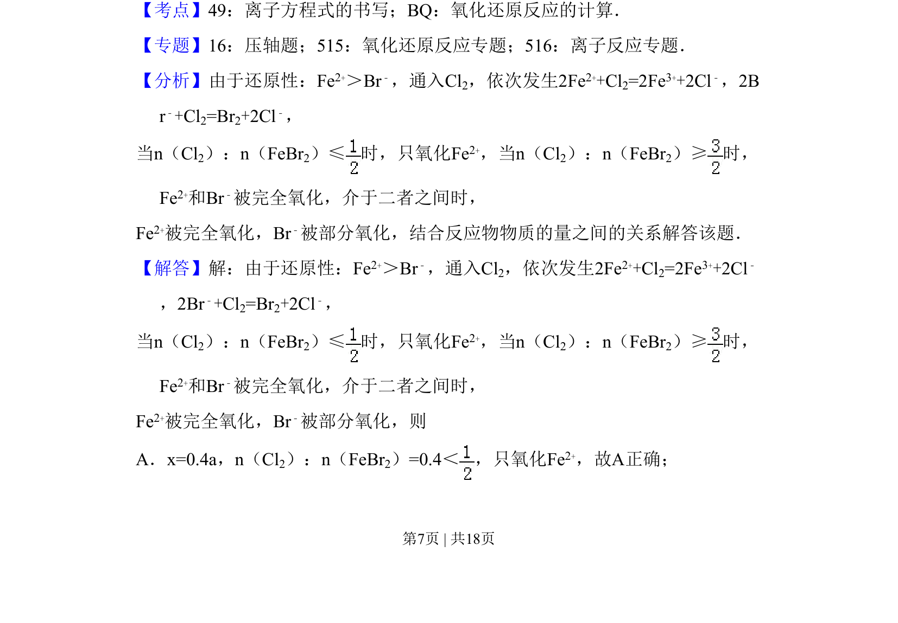
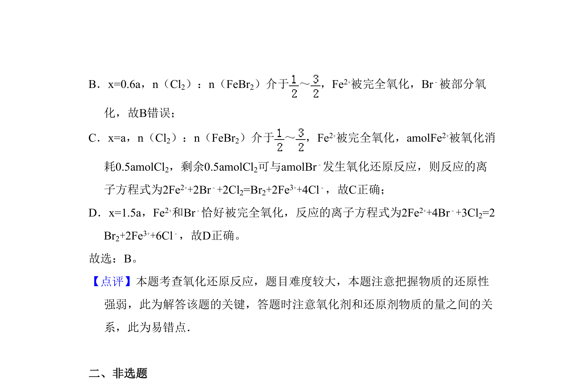

## 题面

## 摘要

该题考查氧化还原反应中离子方程式的书写及反应先后顺序的判断，涉及物质的量相关计算。

## 关联考点

- [[离子方程式的书写]]
- [[氧化还原反应的计算]]
- [[还原性强弱顺序]]

## 答案与解析

> 📄 原 PDF 第 7 页：`素材/真题/吉林/2008-2024·（吉林）化学高考真题/2009年高考化学试卷（全国卷Ⅱ）（解析卷）.pdf`
