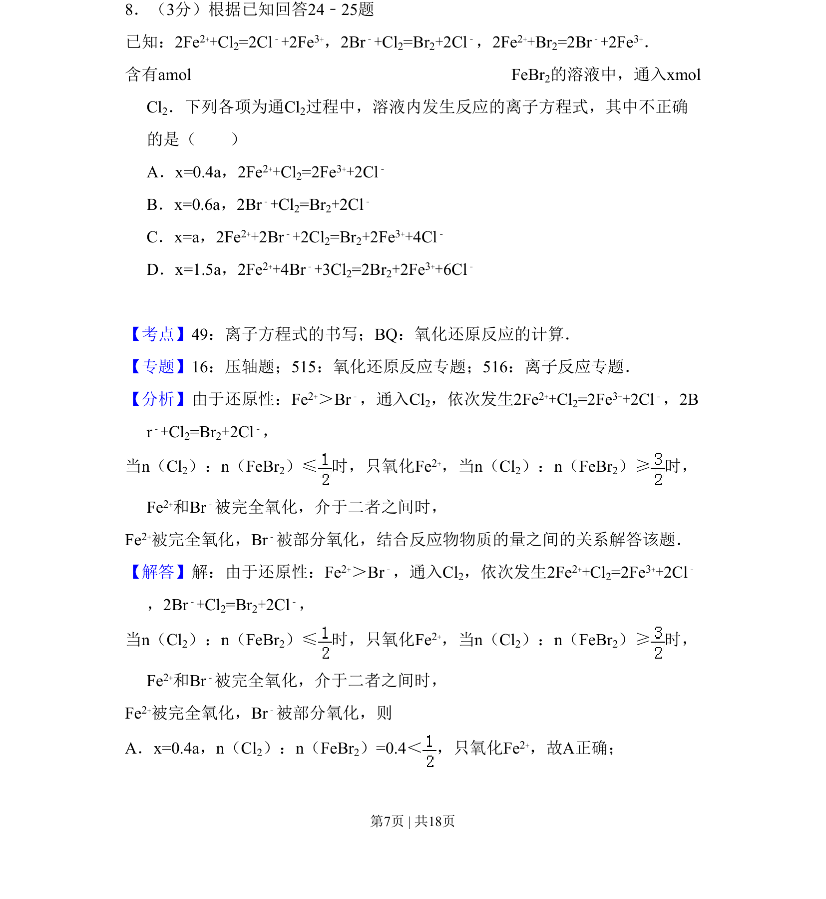
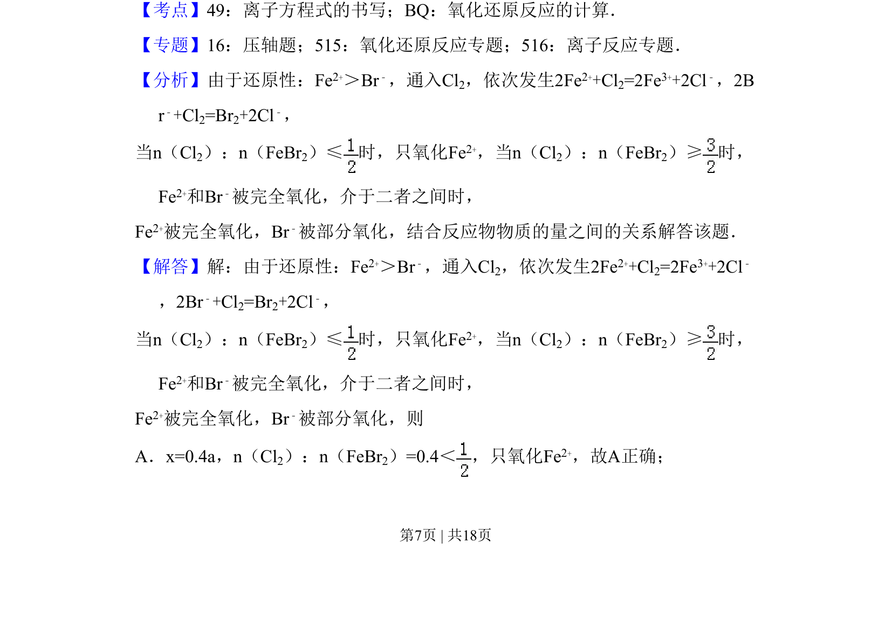
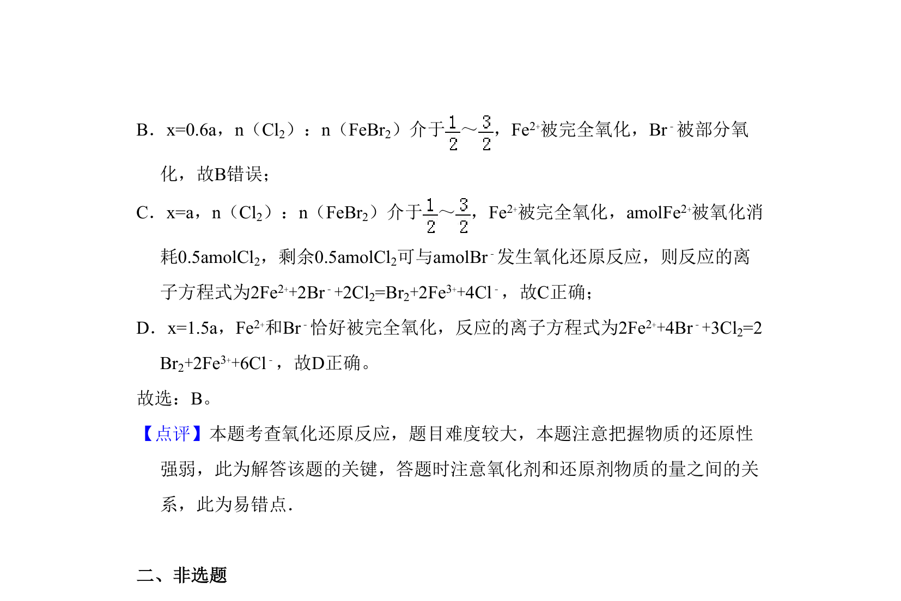

## 题面

## 摘要

该题考查氧化还原反应中离子方程式的书写及反应先后顺序的判断，涉及物质的量相关计算。

## 关联考点

- [[807-离子方程式的书写|离子方程式的书写]]
- [[733-氧化还原反应的计算|氧化还原反应的计算]]
- [[572-还原性强弱顺序|还原性强弱顺序]]

## 答案与解析

> 📄 原 PDF 第 7 页：`素材/真题/吉林/2008-2024·（吉林）化学高考真题/2009年高考化学试卷（全国卷Ⅱ）（解析卷）.pdf`

<!-- 题干文本-start -->
## 题干文本
8．（3分）根据已知回答24﹣25题
已知：2Fe2++Cl2=2Cl﹣+2Fe3+，2Br﹣+Cl2=Br2+2Cl﹣，2Fe2++Br2=2Br﹣+2Fe3+．
含有amol FeBr 2的溶液中，通入xmol 
Cl2．下列各项为通Cl2过程中，溶液内发生反应的离子方程式，其中不正确
的是（　　）
A．x=0.4a，2Fe2++Cl2=2Fe3++2Cl﹣
B．x=0.6a，2Br﹣+Cl2=Br2+2Cl﹣
C．x=a，2Fe2++2Br﹣+2Cl2=Br2+2Fe3++4Cl﹣
D．x=1.5a，2Fe2++4Br﹣+3Cl2=2Br2+2Fe3++6Cl﹣
<!-- 题干文本-end -->

<!-- 解析文本-start -->
## 解析文本
【考点】49：离子方程式的书写；BQ：氧化还原反应的计算．菁优网版权所有
【专题】16：压轴题；515：氧化还原反应专题；516：离子反应专题．
【分析】由于还原性：Fe2+＞Br﹣，通入Cl2，依次发生2Fe2++Cl2=2Fe3++2Cl﹣，2B
r﹣+Cl2=Br2+2Cl﹣，
当n（Cl2）：n（FeBr2）≤时，只氧化Fe 2+，当n（Cl2）：n（FeBr2）≥时，
Fe2+和Br﹣被完全氧化，介于二者之间时，
Fe2+被完全氧化，Br﹣被部分氧化，结合反应物物质的量之间的关系解答该题．
【解答】解：由于还原性：Fe2+＞Br﹣，通入Cl2，依次发生2Fe2++Cl2=2Fe3++2Cl﹣
，2Br﹣+Cl2=Br2+2Cl﹣，
当n（Cl2）：n（FeBr2）≤时，只氧化Fe 2+，当n（Cl2）：n（FeBr2）≥时，
Fe2+和Br﹣被完全氧化，介于二者之间时，
Fe2+被完全氧化，Br﹣被部分氧化，则
A．x=0.4a，n（Cl2）：n（FeBr2）=0.4＜，只氧化Fe 2+，故A正确；
<!-- 解析文本-end -->
