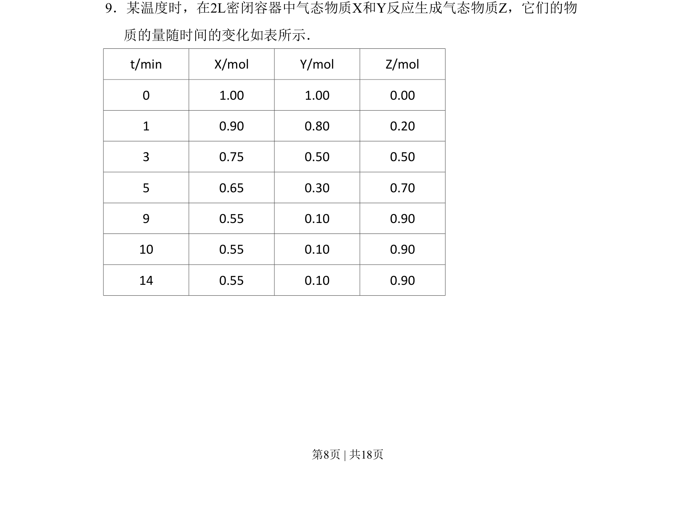
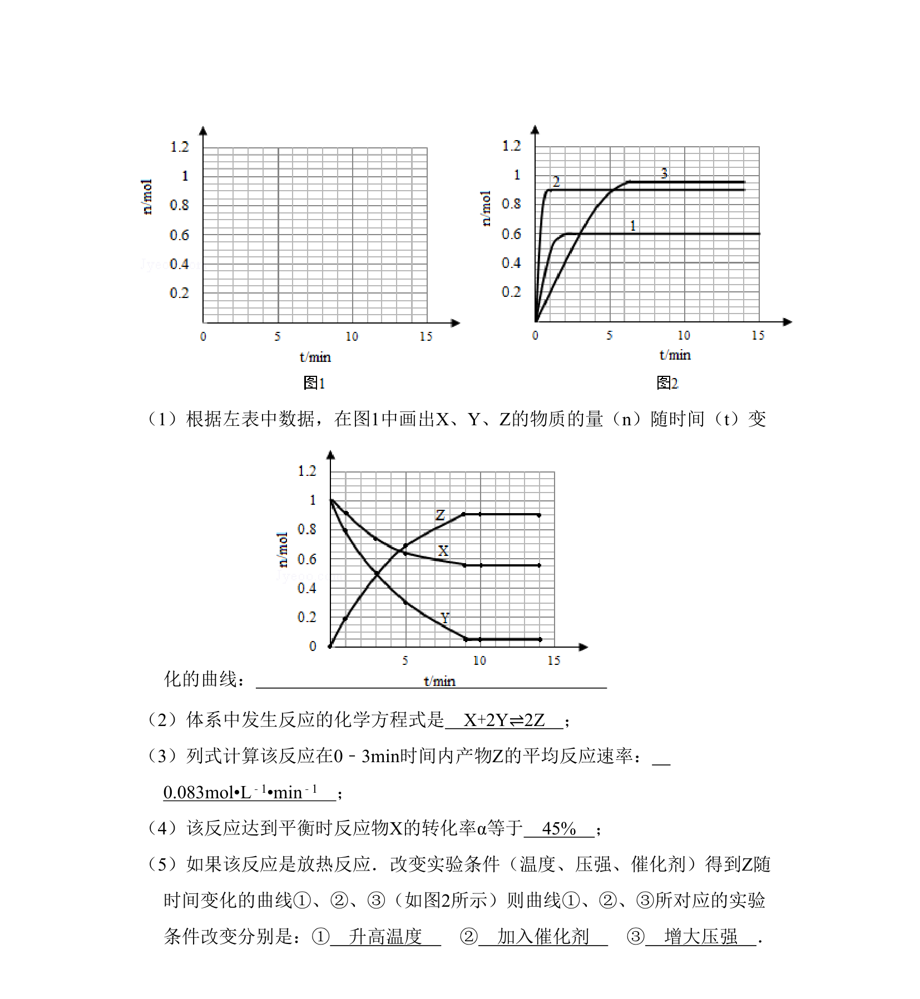
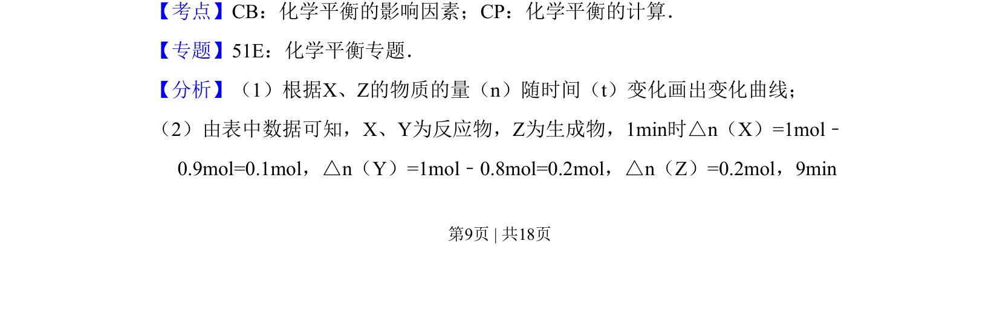
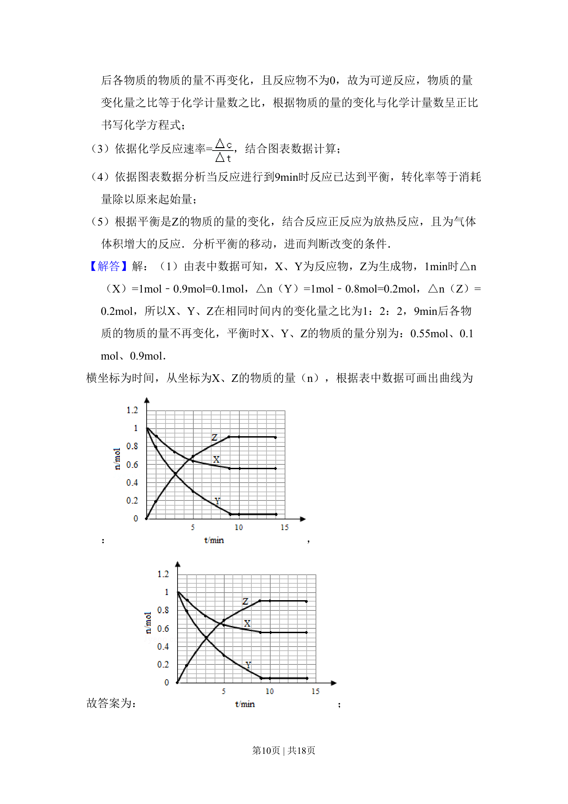
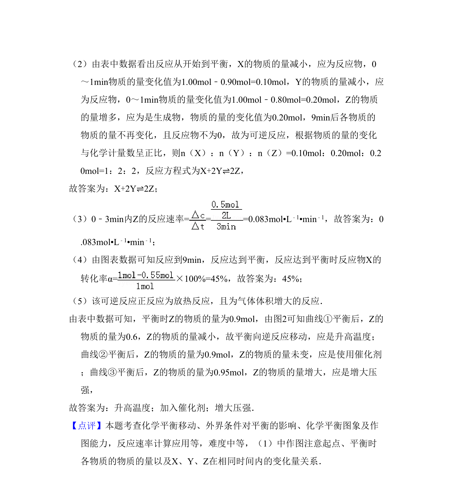

## 题面

## 摘要

本题考查根据反应物和生成物的物质的量变化数据推断化学反应方程式及反应速率。

## 关联考点

- [[284-化学平衡|化学平衡]]
- [[780-物质的量变化计算|物质的量变化计算]]
- [[283-化学反应速率|反应速率]]
- [[628-化学计量数推断|化学计量数推断]]

## 答案与解析

> 📄 原 PDF 第 8 页：`素材/真题/吉林/2008-2024·（吉林）化学高考真题/2009年高考化学试卷（全国卷Ⅱ）（解析卷）.pdf`
