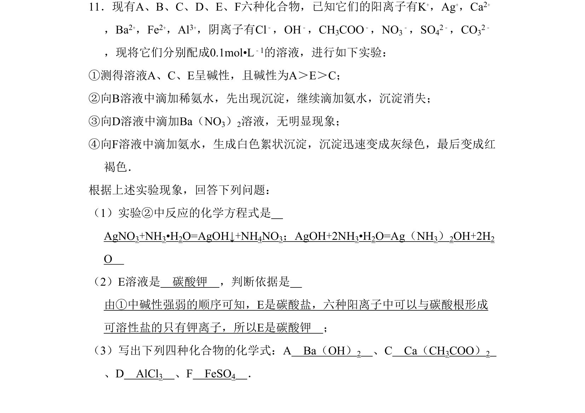
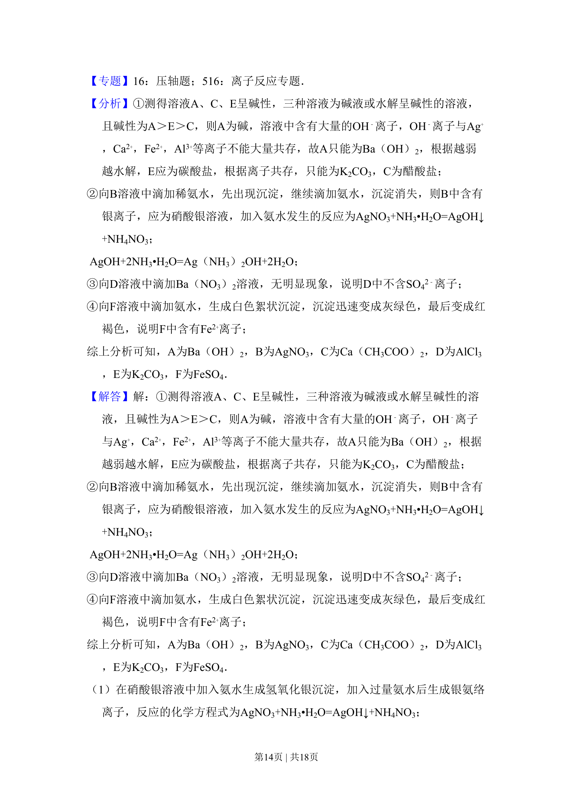
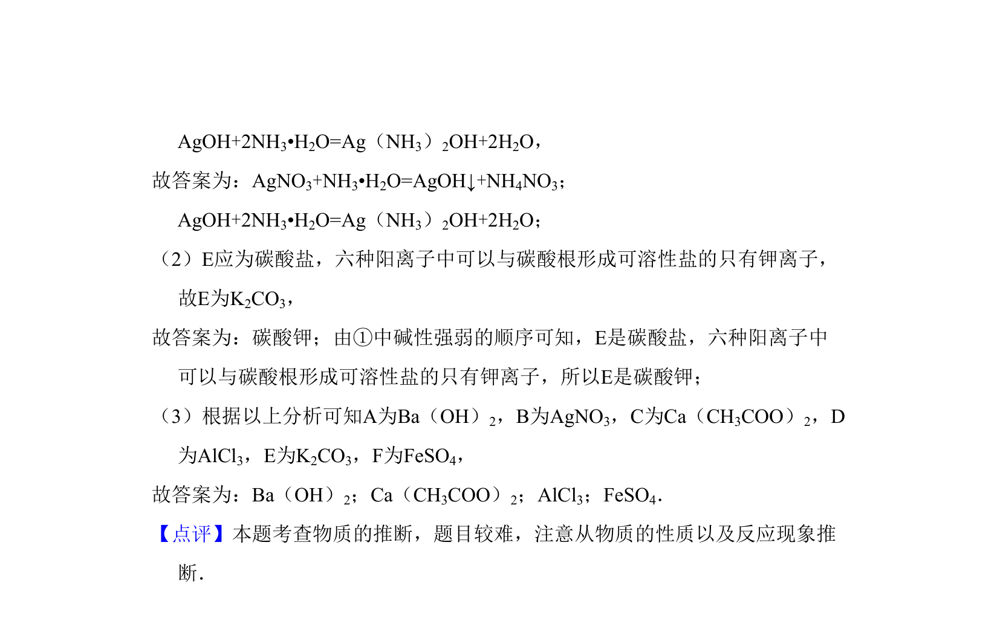

## 题面

## 摘要

根据实验现象推断六种化合物，涉及离子检验与无机物推断

## 关联考点

- [[682-常见离子的检验方法|常见离子的检验方法]]
- [[695-无机物的推断|无机物的推断]]

## 答案与解析

> 📄 原 PDF 第 13 页：`素材/真题/吉林/2008-2024·（吉林）化学高考真题/2009年高考化学试卷（全国卷Ⅱ）（解析卷）.pdf`

<!-- 题干文本-start -->
## 题干文本
11．现有A、B、C、D、E、F六种化合物，已知它们的阳离子有K+，Ag+，Ca2+
，Ba2+，Fe2+，Al3+，阴离子有Cl﹣，OH﹣，CH3COO﹣，NO3
﹣，SO42﹣，CO32﹣
，现将它们分别配成0.1mol•L﹣1的溶液，进行如下实验：
①测得溶液A、C、E呈碱性，且碱性为A＞E＞C；
②向B溶液中滴加稀氨水，先出现沉淀，继续滴加氨水，沉淀消失；
③向D溶液中滴加Ba（NO3）2溶液，无明显现象；
④向F溶液中滴加氨水，生成白色絮状沉淀，沉淀迅速变成灰绿色，最后变成红
褐色．
根据上述实验现象，回答下列问题：
（1）实验②中反应的化学方程式是　
AgNO3+NH3•H2O=AgOH↓+NH4NO3；AgOH+2NH3•H2O=Ag（NH3）2OH+2H2
O　
（2）E溶液是　碳酸钾　，判断依据是　
由①中碱性强弱的顺序可知，E是碳酸盐，六种阳离子中可以与碳酸根形成
可溶性盐的只有钾离子，所以E是碳酸钾　；
（3）写出下列四种化合物的化学式：A　Ba（OH）2　、C　Ca（CH3COO）2　
、D　AlCl3　、F　FeSO4　．
<!-- 题干文本-end -->

<!-- 解析文本-start -->
## 解析文本
【考点】DG：常见离子的检验方法；GS：无机物的推断．菁优网版权所有
<!-- 解析文本-end -->
