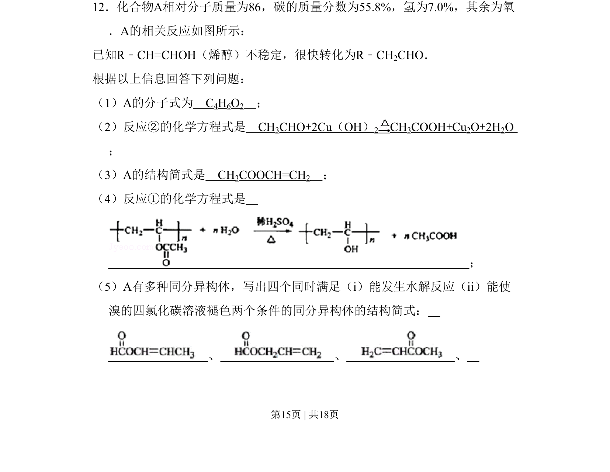
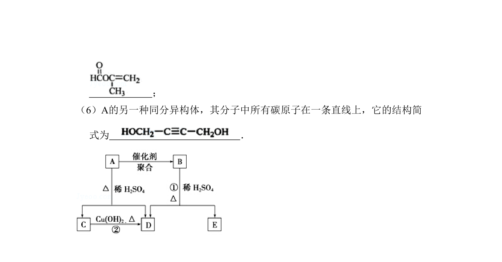
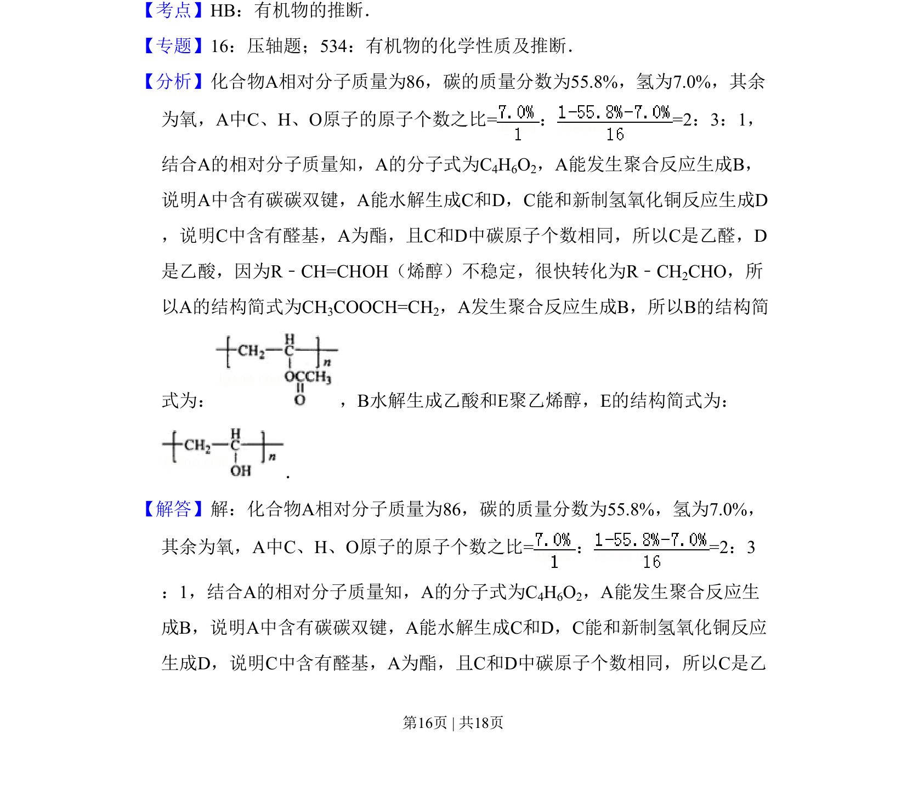
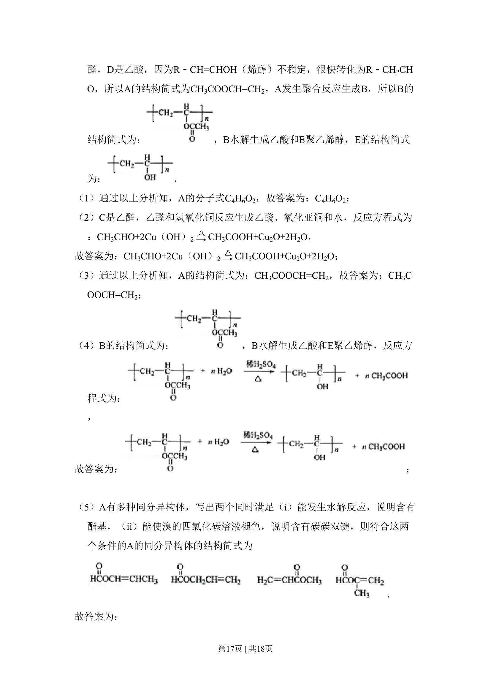
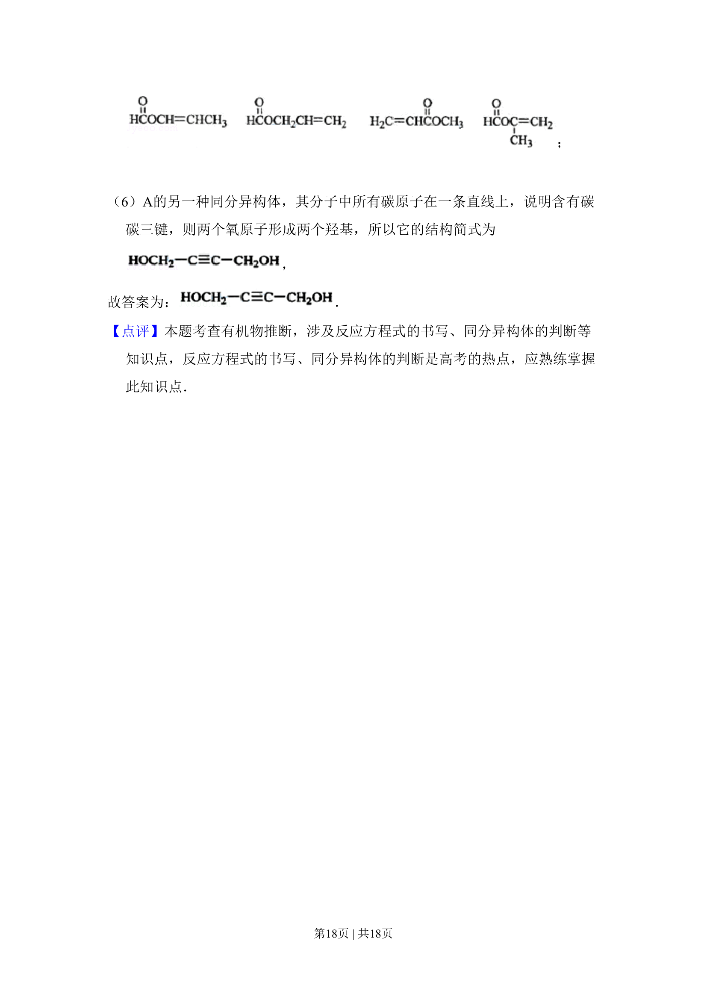

## 题面

## 摘要

该题考查有机化合物分子式确定、结构推断、化学方程式书写及同分异构体书写。

## 关联考点

- [[706-有机化学|有机化学]]
- [[600-分子式确定|分子式确定]]
- [[052-化学方程式|反应方程式]]
- [[446-同分异构体|同分异构体]]

## 答案与解析

> 📄 原 PDF 第 15 页：`素材/真题/吉林/2008-2024·（吉林）化学高考真题/2009年高考化学试卷（全国卷Ⅱ）（解析卷）.pdf`
