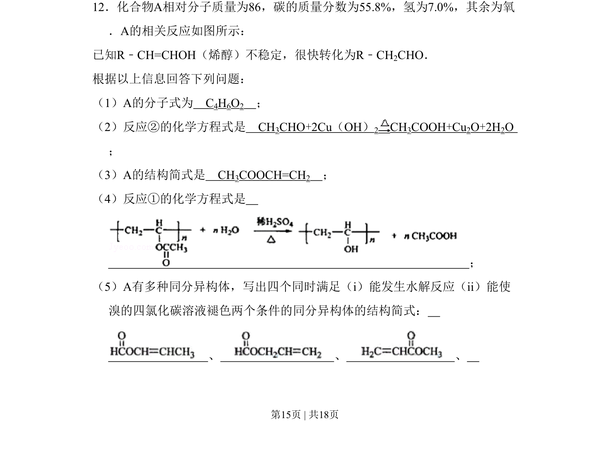
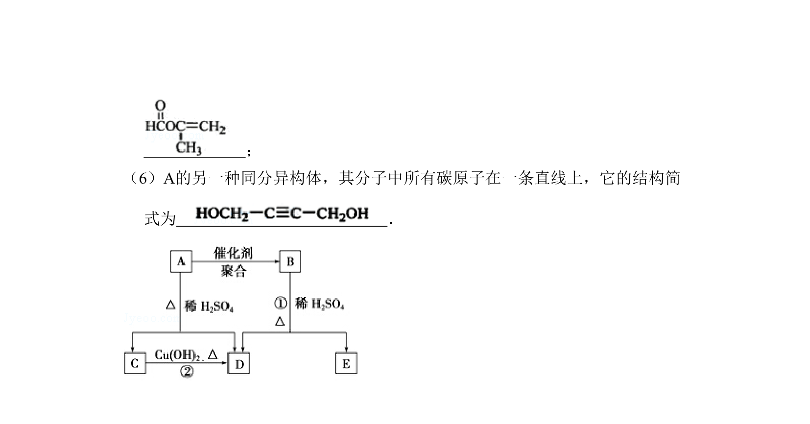
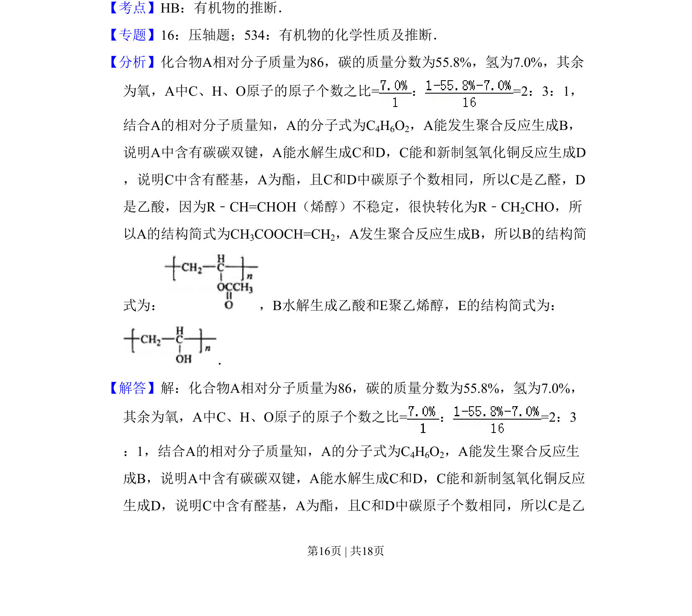
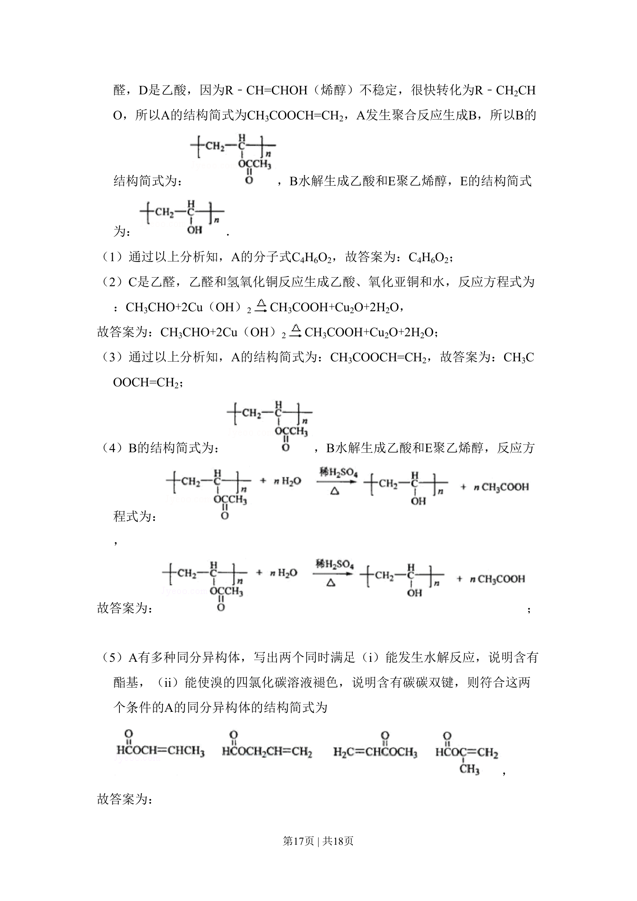
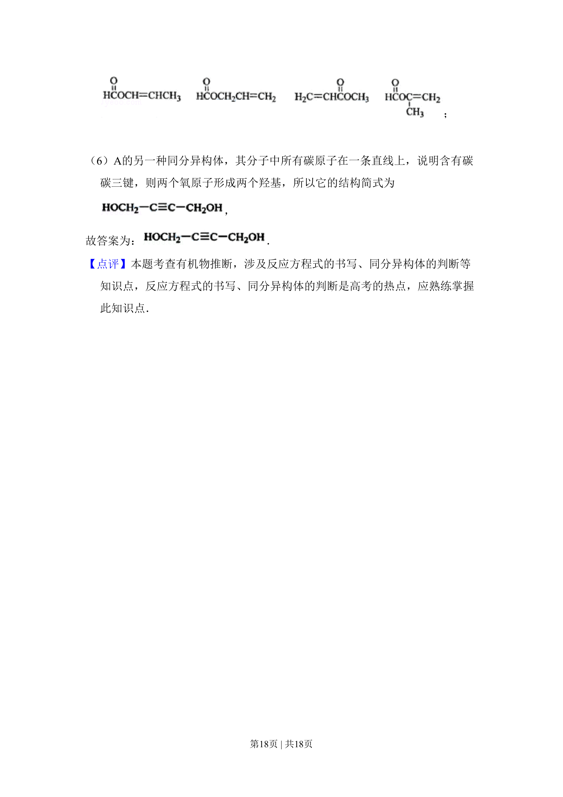

## 题面

## 摘要

该题考查有机化合物分子式确定、结构推断、化学方程式书写及同分异构体书写。

## 关联考点

- [[706-有机化学|有机化学]]
- [[600-分子式确定|分子式确定]]
- [[052-化学方程式|反应方程式]]
- [[446-同分异构体|同分异构体]]

## 答案与解析

> 📄 原 PDF 第 15 页：`素材/真题/吉林/2008-2024·（吉林）化学高考真题/2009年高考化学试卷（全国卷Ⅱ）（解析卷）.pdf`

<!-- 题干文本-start -->
## 题干文本
12．化合物A相对分子质量为86，碳的质量分数为55.8%，氢为7.0%，其余为氧
．A的相关反应如图所示：
已知R﹣CH=CHOH（烯醇）不稳定，很快转化为R﹣CH2CHO．
根据以上信息回答下列问题：
（1）A的分子式为　C4H6O2　；
（2）反应②的化学方程式是　CH3CHO+2Cu（OH）2 CH3COOH+Cu2O+2H2O　
；
（3）A的结构简式是　CH3COOCH=CH2　；
（4）反应①的化学方程式是　
　；
（5）A有多种同分异构体，写出四个同时满足（i）能发生水解反应（ii）能使
溴的四氯化碳溶液褪色两个条件的同分异构体的结构简式：　
　、　 　、　 　、
<!-- 题干文本-end -->

<!-- 解析文本-start -->
## 解析文本

<!-- 解析文本-end -->
