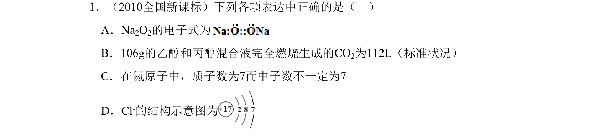
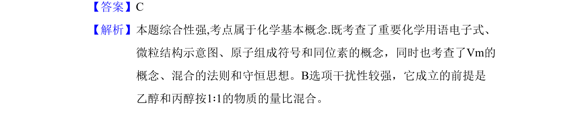

## 题面

## 摘要

考查化学用语、同位素、气体摩尔体积及混合物计算等基本概念，综合性较强。

## 关联考点

- [[624-化学用语|化学用语]]
- [[260-同位素|同位素]]
- [[727-气体摩尔体积|气体摩尔体积]]
- [[759-混合物计算|混合物计算]]

## 答案与解析

> 📄 原 PDF 第 1 页：`素材/真题/吉林/2008-2024·（吉林）化学高考真题/2010年高考化学试卷（新课标）（解析卷）.pdf`
