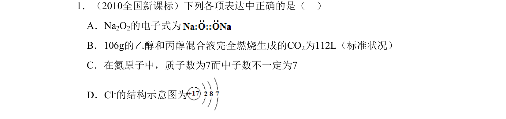
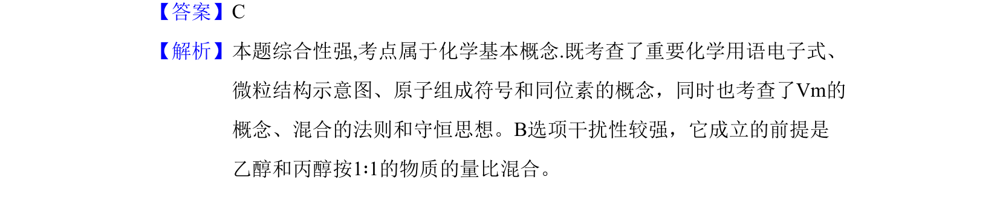

## 题面

## 摘要

考查化学用语、同位素、气体摩尔体积及混合物计算等基本概念，综合性较强。

## 关联考点

- [[624-化学用语|化学用语]]
- [[260-同位素|同位素]]
- [[727-气体摩尔体积|气体摩尔体积]]
- [[759-混合物计算|混合物计算]]

## 答案与解析

> 📄 原 PDF 第 1 页：`素材/真题/吉林/2008-2024·（吉林）化学高考真题/2010年高考化学试卷（新课标）（解析卷）.pdf`

<!-- 题干文本-start -->
## 题干文本
1．（2010全国新课标）下列各项表达中正确的是（    ）
A．Na2O2的电子式为
B．106g的乙醇和丙醇混合液完全燃烧生成的CO2为112L（标准状况）
C．在氮原子中，质子数为7而中子数不一定为7 
D．Cl-的结构示意图为
<!-- 题干文本-end -->

<!-- 解析文本-start -->
## 解析文本
【答案】C
【解析】本题综合性强,考点属于化学基本概念.既考查了重要化学用语电子式、
微粒结构示意图、原子组成符号和同位素的概念，同时也考查了Vm的
概念、混合的法则和守恒思想。B选项干扰性较强，它成立的前提是
乙醇和丙醇按1∶1的物质的量比混合。
<!-- 解析文本-end -->
